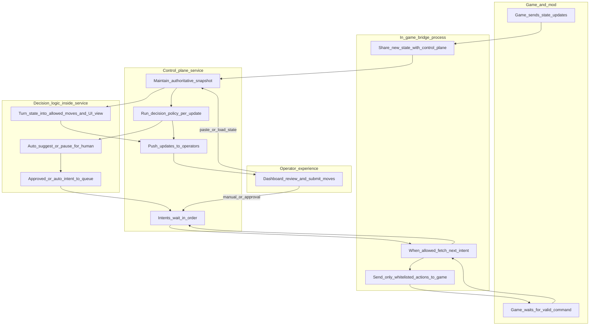
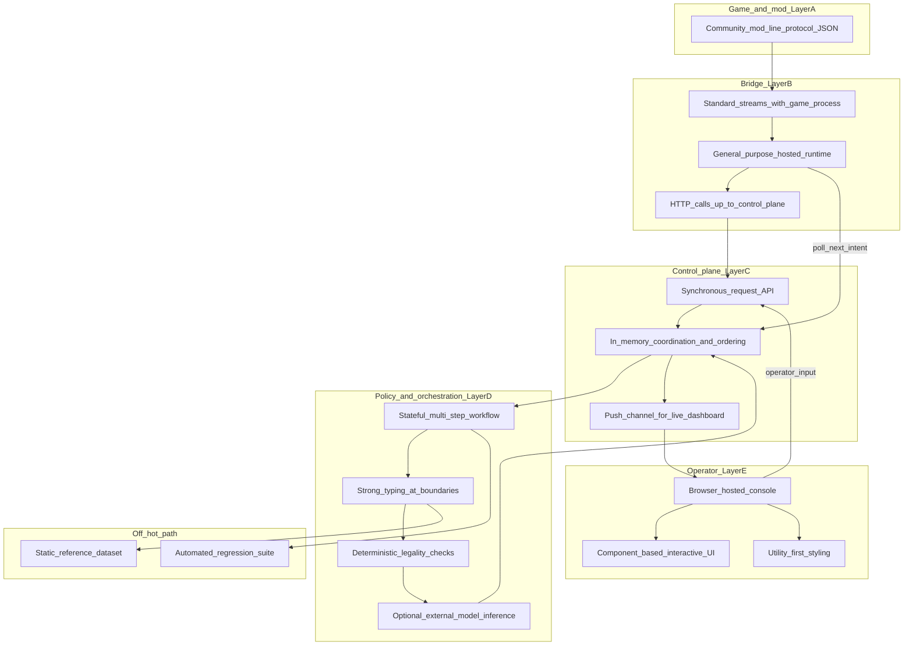
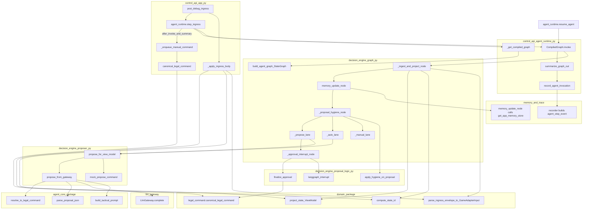

# Architecture (greenfield)

This file describes the **current** layout under [`src/`](src/) and [`apps/web/`](apps/web/). Target-state design notes and migration staging live under [`docs/restart/`](docs/restart/). The **pre-rewrite** Python app (dashboard, old `main`, LangGraph under `src/agent/`, etc.) is frozen in [`archive/legacy_src/`](archive/legacy_src/)—do not treat paths there as live.

## 1. General information flow

At a program level, the system lets operators **see** what the game reports, **decide** (or delegate) the next move under clear safety rules, and **act** only through paths the game already allows. Nobody injects arbitrary text into the mod; everything passes through a **shared picture of the situation** and a **single ordered queue** of validated next actions.

**In plain terms:** the game repeatedly reports the situation and sometimes signals it is ready for a command. The bridge keeps the control plane informed (without repeating identical snapshots) and, when the game is ready, takes the next queued intent—or a safe idle/refresh if nothing is queued. The control plane keeps **allowed moves**, **suggestions**, and **operator actions** aligned. File- and API-level detail is in section 3 and the table below.

---

## 2. Technology shape following the same flow

The diagram below follows the **same story as section 1** (game → bridge → control plane → policy engine → operators), layering **technology categories and ideas** instead of product names. Concrete library choices live in [`pyproject.toml`](pyproject.toml) and [`apps/web/package.json`](apps/web/package.json).

**How to read it:** the **bridge** is intentionally thin so the mod integration stays a simple line protocol; the **control plane** owns the live session everyone agrees on. **Orchestration** is where multi-step policy runs (including human-in-the-loop pauses when you want them). **Optional inference** is deployment-specific—the same flow works with fixed stub logic for lab or CI. **Supporting** boxes are governance and correctness, not part of every request path.

---

## 3. Detailed flow: modules, classes, and entrypoints

Call chain for a **new ingress** through the HTTP path and **`step_ingress`**. Resume/retry paths noted inline.

**Legend and gaps in the diagram**

| Topic | Code fact |
|-------|-----------|
| `proposal_hygiene` routing | `_route_mode` runs **exactly one** of `manual_lane`, `auto_lane`, or `propose_lane` after hygiene (edges show all three for reference). |
| `propose_for_view_model` | **`mock`** → `mock_propose_command`; **`llm`** → `propose_from_gateway` (both edges from `dispatch` are mutually exclusive). |
| `GameAdapterInput`, `ViewModel` | Pydantic models in [`src/domain/contracts/`](src/domain/contracts/); `project_state` returns `ViewModel`. |
| Graph state | `AgentGraphState` (`TypedDict` in [`graph.py`](src/decision_engine/graph.py)) holds `ingress_raw`, `view_model`, `proposal`, `emitted_command`, `memory_log`, etc. |
| `resume_agent` | `CompiledGraph.invoke(Command(resume=...))` resumes from checkpoint; [`finalize_approval`](src/decision_engine/proposal_logic.py) applies approve / reject / edit. |
| `main.py` (not drawn) | Calls `parse_ingress_envelope`, `compute_state_id`, `project_state`, `validate_operator_command` / `validate_idle_command` from [`src/game_adapter/emit.py`](src/game_adapter/emit.py) before `print`. |
| `GET /api/debug/poll_instruction` | Pops [`_manual_command_queue`](src/control_api/app.py); same queue receives UI `POST /api/debug/manual_command` and graph-enqueued commands after `canonical_legal_command` in `_enqueue_manual_command`. |
| `retry_agent` | May `invoke(Command(resume="reject"))` then `invoke({"ingress_raw": ...})` — see [`agent_runtime.retry_agent`](src/control_api/agent_runtime.py). |
| Tests | [`src/evaluation/replay.py`](src/evaluation/replay.py) builds a fresh `build_agent_graph` + `InMemorySaver` per sequence. |

---

## Components (summary)

| Piece | Role |
|-------|------|
| [`src/main.py`](src/main.py) | Mod I/O: `ready`, read JSON, push ingress to API (deduped), poll queue, validate, `print` command or idle. |
| [`src/control_api/app.py`](src/control_api/app.py) | FastAPI: debug ingress/snapshot/trace, manual queue, agent resume/retry, WebSocket broadcast. |
| [`src/control_api/agent_runtime.py`](src/control_api/agent_runtime.py) | In-process LangGraph compile (`build_agent_graph`), checkpointer from [`checkpoint_factory`](src/control_api/checkpoint_factory.py), `step_ingress` / `resume_agent` / `retry_agent`. |
| [`src/control_api/history.py`](src/control_api/history.py) | Read-only `GET /api/history/threads`, `/events`, `/checkpoints`. |
| [`src/control_api/checkpoint_factory.py`](src/control_api/checkpoint_factory.py) | `SLAY_CHECKPOINTER` = `memory` \| `sqlite` + `SLAY_SQLITE_PATH`. |
| [`src/decision_engine/graph.py`](src/decision_engine/graph.py) | LangGraph: ingest → project → **manual** / **auto** / **propose** (HITL `interrupt`) → memory node. |
| [`src/decision_engine/proposer.py`](src/decision_engine/proposer.py) | `mock` vs `llm` → [`src/agent_core/`](src/agent_core/) + [`src/llm_gateway/`](src/llm_gateway/). |
| [`src/domain/state_projection/`](src/domain/state_projection/) | Ingress → `ViewModel`, legal actions, KB enrichment via [`src/reference/knowledge_base.py`](src/reference/knowledge_base.py) and `data/processed/*.json`. |
| [`src/game_adapter/`](src/game_adapter/) | Emit-side validation (`validate_operator_command`, `validate_idle_command`). |
| [`src/memory/`](src/memory/) | Bounded episodic `memory_log` in graph state; in-process namespaced store (`last_turn` per class). |
| [`src/trace_telemetry/`](src/trace_telemetry/) | `SLAY_TRACE_BACKEND` = `memory` \| `sqlite`; `GET /api/debug/trace`; `SLAY_TRACE_ENABLED`, `SLAY_TRACE_MAX_EVENTS` (memory cap only). |
| [`src/evaluation/replay.py`](src/evaluation/replay.py) | Test/CI helpers: replay ingress sequences against a fresh checkpointer (not log-dir CLI). |
| [`apps/web/`](apps/web/) | Operator UI: projection, legal actions, HITL, history explorer rail, live WS (proxies to API :8000). |

## Decision modes (env)

- `SLAY_AGENT_MODE`: `manual` | `auto` | `propose` (default `propose`).
- `SLAY_PROPOSER`: `mock` | `llm`; `SLAY_LLM_BACKEND`: `stub` | `openai`.
- `SLAY_AGENT_THREAD_ID`: LangGraph thread (default `default`). With `SLAY_CHECKPOINTER=sqlite`, keep this stable across API restarts to continue the same session.

## Persistence (checkpoints + telemetry)

- **`SLAY_CHECKPOINTER`**: `memory` (default) or `sqlite`. SQLite uses LangGraph `SqliteSaver` tables in one file.
- **`SLAY_SQLITE_PATH`**: optional; defaults to `logs/slay_agent.sqlite` (directory created as needed). Checkpoints and `trace_events` share this file when both use SQLite.
- **`SLAY_TRACE_BACKEND`**: `memory` (default) or `sqlite` for append-only `agent_step` rows (`trace_events` table).
- **API**: `GET /api/history/threads`, `GET /api/history/events`, `GET /api/history/checkpoints?thread_id=…` (checkpoint timeline via `CompiledStateGraph.get_state_history`).
- **Future**: full [`docs/restart/16-sqlite-telemetry-and-history-explorer-spec.md`](docs/restart/16-sqlite-telemetry-and-history-explorer-spec.md) schema (`runs`, `decisions`, `stream_events`, …) is not implemented yet—current `trace_events` is the minimal append log.

## Planned / not this tree

- Standalone **log-directory replay CLI** over recorded CommunicationMod runs (legacy pattern under `archive/`).
- **Dedicated `knowledge_service`** process (enrichment stays in [`src/domain/state_projection/`](src/domain/state_projection/) + [`src/reference/`](src/reference/)).
