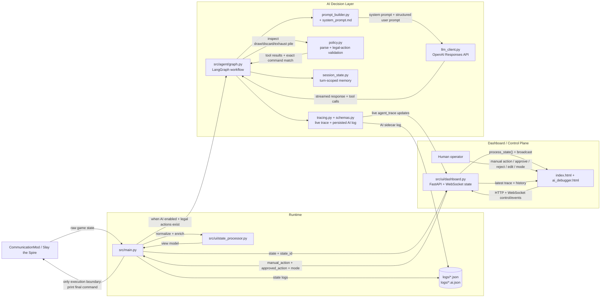

# Architecture

```mermaid
flowchart LR
    GM[CommunicationMod / Slay the Spire]

    subgraph Runtime["Runtime"]
        MAIN["src/main.py"]
        PROC["src/ui/state_processor.py"]
        LOGS[("logs/*.json\nlogs/*.ai.json")]
    end

    subgraph Dashboard["Dashboard / Control Plane"]
        API["src/ui/dashboard.py\nFastAPI + WebSocket state"]
        UI["index.html + ai_debugger.html"]
        USER["Human operator"]
    end

    subgraph Agent["AI Decision Layer"]
        GRAPH["src/agent/graph.py\nLangGraph workflow"]
        PROMPT["prompt_builder.py\n+ system_prompt.md"]
        LLM["llm_client.py\nOpenAI Responses API"]
        POLICY["policy.py\nparse + legal-action validation"]
        SESSION["session_state.py\nturn-scoped memory"]
        TRACE["tracing.py + schemas.py\nlive trace + persisted AI log"]
    end

    GM -->|"raw game state"| MAIN
    MAIN -->|"normalize + enrich"| PROC
    PROC -->|"view model"| MAIN
    MAIN -->|"state + state_id"| API
    API -->|"process_state() + broadcast"| UI
    USER -->|"manual action / approve / reject / edit / mode"| UI
    UI -->|"HTTP + WebSocket control/events"| API
    API -->|"manual_action + approved_action + mode"| MAIN

    MAIN -->|"when AI enabled + legal actions exist"| GRAPH
    GRAPH --> PROMPT
    PROMPT -->|"system prompt + structured user prompt"| LLM
    LLM -->|"streamed response + tool calls"| GRAPH
    GRAPH -->|"inspect draw/discard/exhaust pile"| POLICY
    POLICY -->|"tool results + exact command match"| GRAPH
    GRAPH --> SESSION
    GRAPH --> TRACE
    TRACE -->|"live agent_trace updates"| API
    API -->|"latest trace + history"| UI

    MAIN -->|"state logs"| LOGS
    TRACE -->|"AI sidecar log"| LOGS

    MAIN -->|"only execution boundary:\nprint final command"| GM
```
