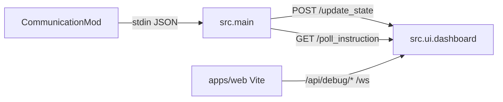

# Architecture (`src/`)

The Python package under [`src/`](src/) is the live runtime: an in-process LangGraph-style agent ([`src/agent/graph.py`](src/agent/graph.py)), [`src/main.py`](src/main.py) as the CommunicationMod bridge, and [`src/ui/dashboard.py`](src/ui/dashboard.py) as the operator HTTP + WebSocket server.

## Data flow

- **Game → bridge:** each line of game state JSON is sent to the dashboard with `meta.state_id` and processed with [`src/ui/state_processor.py`](src/ui/state_processor.py).
- **Bridge → game:** when `ready_for_command`, `main` polls for `manual_action` or `approved_action`, validates against the current legal list, and **prints** the command for the mod.
- **Operators:** the React monitor on Vite (proxies /api and /ws to port 8000); the dashboard emits **`snapshot`** payloads over **`/ws`**.

## React operator UI

[`src/ui/dashboard.py`](src/ui/dashboard.py) maps **`ai_runtime`**, **`latest_trace`** ([`AgentTrace`](src/agent/schemas.py)), and last ingress into the **`DebugSnapshotPayload`** shape expected by [`apps/web`](apps/web/). History endpoints are **stubs** until a log- or trace-backed implementation exists.
