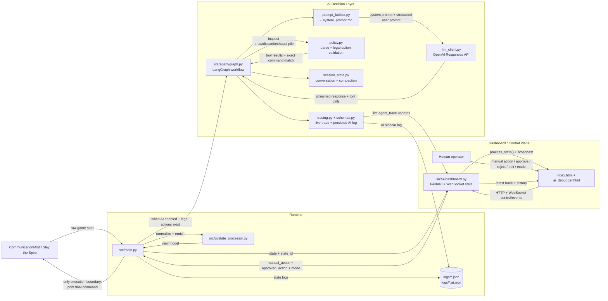

# Architecture

---

## Agent prompt structure

The user prompt is built in `src/agent/prompt_builder.py` by `build_user_prompt(vm, state_id, recent_actions)`. It does **not** include a STATE ID section (the state ID is for internal tracing only).

### Sections (in order)

| Section | Purpose |
|---------|---------|
| **PLAYER STATE** | class, floor, hp, gold, energy, turn, block (in combat) |
| **LEGAL ACTIONS** | Numbered label + command for all legal actions |
| **VALID PLAYS** | Subset of legal actions that are PLAY commands (for quick parsing) |
| **MONSTERS** | hp, intent, powers, known_moves (first 3), notes, ai (from KB when available) |
| **HAND** | Cards with cost, targeted, upgrades, desc |
| **PLAYER POWERS** | Active powers (e.g. No Draw) |
| **RELICS** | Name + short description |
| **POTIONS** | Indexed list with effect from KB when available |
| **MAP PLANNING** | Only when `screen.type == "MAP"`: current_position, next_nodes (symbol@x,y), boss_available, boss name + notes/ai |
| **CURRENT SCREEN** | type, title, content_keys |
| **RECENT EXECUTED ACTIONS** | Last 5 executed actions this scene |
| **TOOLING NOTES** | When to use pile inspection tools |

Monster **notes** and **ai** come from `data/processed/monsters.json` via `get_monster_info()` in the state processor; the prompt builder reads them from each monster’s `kb`. MAP planning uses `vm["map"]`: `next_nodes`, `current_node`, `boss_available`, `boss_name`, `boss_kb`.

System instructions live in `src/agent/prompts/system_prompt.md` (gameplay guidance, elite reminders, rules, `<final_decision>` format).

---

## Chat history and compaction

History is **not** reset per scene. It persists across combat, map, rewards, events, etc.

- **Scene key** — `build_turn_key(vm)` in `src/agent/tracing.py` identifies the current scene (e.g. `COMBAT:12`, `MAP:12`). Used to scope per-scene **action** history only; the conversation `messages` list is global.
- **Compaction** — When the session’s estimated token count exceeds `history_compact_token_threshold`, older user/assistant pairs are summarized by the fast model into a single `## COMPACTED HISTORY` user message. The last `history_keep_recent` exchanges are kept verbatim.
- **Config** — `LLM_HISTORY_COMPACT_TOKEN_THRESHOLD` (default 100_000), `LLM_HISTORY_KEEP_RECENT` (default 6). Token estimation and compaction logic are in `src/agent/session_state.py` (`TurnConversation.needs_compaction`, `compact_history`); the summarization call is `llm_client.summarize_history_compaction()` invoked from `graph.py` in `_build_prompt`.

---

## Traces and persisted AI log

- **AgentTrace** — Live trace per decision: prompts, streamed output, parsed proposal, validation, final_decision, approval_status, latency, **token_usage** (input_tokens, output_tokens, total_tokens).
- **PersistedAiLog** — Written alongside each state log as `<state_log>.ai.json`. Contains user_message, assistant_message, status, final_decision, approval_status, **input_tokens**, **output_tokens**, **total_tokens**, error. Built by `build_persisted_ai_log(trace)` in `src/agent/tracing.py`.

---

## Key files

| File | Role |
|------|------|
| `src/agent/prompt_builder.py` | Builds user prompt from VM; monster/relic/potion lines, MAP PLANNING when screen is MAP |
| `src/agent/prompts/system_prompt.md` | System instructions for the agent |
| `src/agent/tracing.py` | `build_state_id`, `build_turn_key()`, `create_trace()`, `build_persisted_ai_log()`, `write_ai_log()` |
| `src/agent/session_state.py` | `TurnConversation`: messages, action_history, `set_scene()`, `needs_compaction()`, `compact_history()` |
| `src/agent/llm_client.py` | LLM calls, streaming, tool handling; `summarize_history_compaction()` for history compaction |
| `src/agent/graph.py` | LangGraph workflow; `_build_prompt` (session.set_scene, compaction check, build_user_prompt), run_agent, tools, validation |
| `src/agent/config.py` | AgentConfig: models, timeouts, `history_compact_token_threshold`, `history_keep_recent` |
| `src/agent/schemas.py` | AgentTrace, PersistedAiLog, TraceTokenUsage, ParsedAgentTurn, FinalDecision, etc. |
| `data/processed/monsters.json` | Monster KB (moves, notes, ai) used via `get_monster_info()` in state processor |
| `data/processed/relics.json` | Relic descriptions for prompt and UI |
