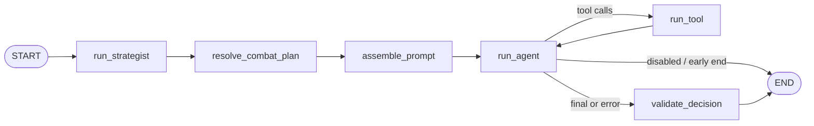
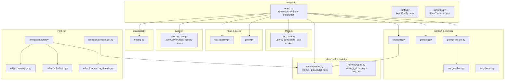
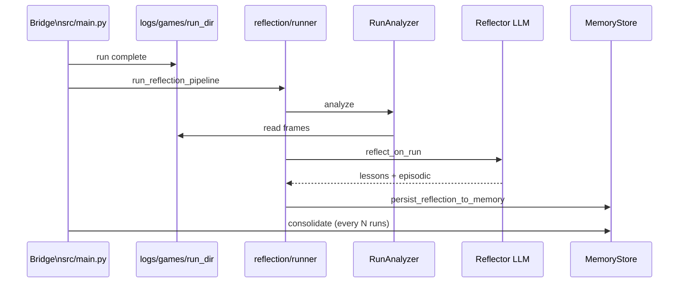

# Architecture

This document describes how **Spire Agent** is structured end to end: the **bridge**, the **dashboard** (FastAPI), the **LangGraph** decision pipeline, durable knowledge and memory, reflection, and the **operator UI** (React). Paths are relative to the repository root unless noted.

**Diagrams (repository root, kebab-case filenames):**

| Document | Contents |
|----------|----------|
| [data-flow-diagram.md](data-flow-diagram.md) | Data paths: CommunicationMod ↔ bridge ↔ dashboard, view model, LangGraph, logs, `MEMORY_DIR`, reflection |
| [user-sequence-diagram.md](user-sequence-diagram.md) | Operator UI, WebSocket snapshots, HITL approve/manual/auto, `poll_instruction`, stdout back to the game |

---

## 1. System overview

In development, three cooperating processes are usual: the **dashboard** (`uvicorn src.ui.dashboard:app`), the **bridge** (`src/main.py`, stdin/stdout to CommunicationMod), and optionally the **Vite** dev server for the operator UI (`apps/web`, proxy `/api` and `/ws` to the dashboard). The game mod pushes JSON state to the bridge; the bridge forwards it to the dashboard; the dashboard runs the agent when asked and exposes HTTP/WebSocket for the UI.

**Ingress:** each game state line is handled by [`src/main.py`](src/main.py), which `POST`s to [`/update_state`](src/ui/dashboard.py); the dashboard uses [`src/ui/state_processor.py`](src/ui/state_processor.py) to build the **view model** (`vm`) consumed by the agent and operator UI.

**Egress:** when the mod is ready for input, the bridge `GET`s [`/poll_instruction`](src/ui/dashboard.py), receives a manual or AI-approved command, validates it against the current legal list, and **prints** the line for the mod.

For a visual of stores and the LangGraph path, see [data-flow-diagram.md](data-flow-diagram.md). For operator and game timing, see [user-sequence-diagram.md](user-sequence-diagram.md).

---

## 2. Dashboard HTTP and WebSocket surface

The dashboard is the single long-lived Python service that owns **`SpireDecisionAgent`**, session state, and broadcasting snapshots to browsers.

| Cluster | Role | Representative routes |
|--------|------|-------------------------|
| Bridge | Game loop integration | `POST /update_state`, `GET /poll_instruction`, `POST /action_taken`, `POST /log`, `POST /agent_trace` |
| AI / HITL | Modes, approval, retries | `POST /api/ai/approve`, `POST /api/ai/reject`, `POST /api/ai/mode`, `POST /api/ai/auto_start`, `GET /api/ai/state`, `GET /api/ai/retry_poll`, `POST /api/agent/retry`, `GET /api/agent/status`, `POST /api/agent/resume` |
| Debug / live | Snapshot + manual play | `GET /api/debug/snapshot`, `POST /api/debug/ingress`, `POST /api/debug/manual_command`, `GET /api/debug/poll_instruction`, **`WebSocket /ws`** (`snapshot` events) |
| Runs / metrics | Log-backed analytics | `GET /api/runs`, `GET /api/runs/{run_name}/metrics`, `GET /api/runs/{run_name}/map_history`, `GET /api/runs/{run_name}/frames`, … |
| History (stub) | Placeholder | `GET /api/history/*` — not backed by persistent thread storage yet |

Implementation: [`src/ui/dashboard.py`](src/ui/dashboard.py). The React app expects a **`DebugSnapshotPayload`**-shaped snapshot (AI runtime, latest trace, ingress metadata); see [`src/agent/schemas.py`](src/agent/schemas.py) for trace types.

---

## 3. LangGraph decision pipeline (detailed)

The in-process agent is [`SpireDecisionAgent`](src/agent/graph.py). It compiles a **`StateGraph`** over **`GraphState`**: view model (`vm`), prompts, messages, tool round-trips, **`AgentTrace`**, memory hits, strategist output, and planning blocks.

**Node responsibilities**

| Node | Module glue | What it does |
|------|-------------|----------------|
| **`run_strategist`** | [`strategist.py`](src/agent/strategist.py), [`memory/store.py`](src/agent/memory/store.py), [`memory/context_tags.py`](src/agent/memory/context_tags.py) | On a new “scene”, builds tags, retrieves a large pool of procedural hits from `MemoryStore`, loads a compact **knowledge index** from markdown under `KNOWLEDGE_DIR`, and (if AI is on) calls the **support** model to pick final lesson hits and emit `planning_context_block` / `non_combat_plan_block`. Caches hits for the same scene. |
| **`resolve_combat_plan`** | [`planning.py`](src/agent/planning.py) | Combat-only: produces combat planner summary / guide for turn 1+ as configured; does not overwrite strategist-owned non-combat plan text. |
| **`assemble_prompt`** | [`prompt_builder.py`](src/agent/prompt_builder.py), [`session_state.py`](src/agent/session_state.py), [`llm_client.py`](src/agent/llm_client.py) | Sets scene on the session; may **compact** older chat via the support model when over token threshold; builds the user prompt from VM, action history, strategy notes, combat guide, **memory hits**; prepends strategist/planning blocks; appends user message to `TurnConversation`. |
| **`run_agent`** | [`llm_client.py`](src/agent/llm_client.py), [`tool_registry.py`](src/agent/tool_registry.py) | Calls the **decision** model with tools (effort from config); records LLM segments on the trace. |
| **`run_tool`** | [`tool_registry.py`](src/agent/tool_registry.py) | Executes tool calls; increments round-trip counter; loops back to **`run_agent`**. |
| **`validate_decision`** | [`policy.py`](src/agent/policy.py) | Parses model output, validates the chosen command against policy and legality, finalizes trace status. |

**Prompt construction:** [`build_user_prompt`](src/agent/prompt_builder.py) incorporates the processed VM; it can attach **map path analysis** via [`map_analysis.analyze_map_paths`](src/agent/map_analysis.py) when the screen supplies map data. Reference card text can be enriched from [`src/reference/knowledge_base.py`](src/reference/knowledge_base.py) (`data/reference/*.json`).

**System prompt:** loaded from [`src/agent/prompts/system_prompt.md`](src/agent/prompts/system_prompt.md) through [`config.load_system_prompt`](src/agent/config.py).

How this subgraph sits in the wider system (bridge, dashboard, disks) is summarized in [data-flow-diagram.md](data-flow-diagram.md).

---

## 4. Agent package map (file-level)

**Bridge-only / eval:** [`src/main.py`](src/main.py) orchestrates proposal futures, queueing multi-command sequences, `finalize_ai_execution`, and schedules **`run_reflection_pipeline`** plus periodic **`consolidate_procedural_memory`** after runs. [`src/eval/replay.py`](src/eval/replay.py) can replay logged frames without the game.

---

## 5. Reflection and consolidation (detailed)

When a run directory under `logs/games/` is finalized, the bridge may start a background job that:

1. **`RunAnalyzer.analyze(game_dir)`** — builds a structured run report ([`reflection/analyzer.py`](src/agent/reflection/analyzer.py)).
2. **`reflect_on_run`** — decision model proposes procedural lessons and episodic summary ([`reflection/reflector.py`](src/agent/reflector.py)).
3. **`persist_reflection_to_memory`** — writes into `MemoryStore` ([`reflection/memory_storage.py`](src/agent/reflection/memory_storage.py)); lesson outcomes can be updated from victory/defeat.
4. Writes **`reflection_output.json`** beside the run for debugging.

Separately, **`consolidate_procedural_memory`** ([`reflection/consolidator.py`](src/agent/reflection/consolidator.py)) runs every **`CONSOLIDATION_EVERY_N_RUNS`** (see [`main._schedule_post_run_consolidation`](src/main.py)) to archive or merge low-confidence procedural entries without an LLM.

---

## 6. Operator UI (`apps/web`)

Vite + React Router: monitor (`/`), run metrics (`/metrics`), multi-run compare (`/metrics/compare`), map replay (`/metrics/map`). Dev server proxies **`/api`** and **`/ws`** to **`127.0.0.1:8000`**. See [`apps/web/README.md`](apps/web/README.md) and route table in [`apps/web/src/App.tsx`](apps/web/src/App.tsx).

Interaction flow with the dashboard and bridge: [user-sequence-diagram.md](user-sequence-diagram.md).

---

## 7. Data directories (conceptual)

| Location | Consumed by | Purpose |
|----------|-------------|---------|
| `data/knowledge/**` | `MemoryStore` index + strategist index | Human-authored strategy markdown for retrieval |
| `data/reference/*.json` | `knowledge_base.DataStore`, tools, prompts | Spreadsheet-derived facts (cards, relics, …) |
| `MEMORY_DIR` (default `data/memory`) | `MemoryStore` | Procedural/episodic lessons, consolidation counter |
| `logs/games/<run>/` | Bridge writes; metrics UI + reflection reads | `*.json` frames, optional `*.ai.json`, reports |

---

## 8. Wire-level ingress (minimal)

- **Game → bridge:** each line includes `meta.state_id` and is normalized through [`process_state`](src/ui/state_processor.py).
- **Bridge → dashboard:** `POST /update_state` with the same envelope the mod sent.
- **Operators:** WebSocket **`/ws`** broadcasts **`snapshot`** payloads so the monitor stays live without polling everything.

End-to-end sequence (operator, UI, dashboard, bridge, CommunicationMod): [user-sequence-diagram.md](user-sequence-diagram.md).
