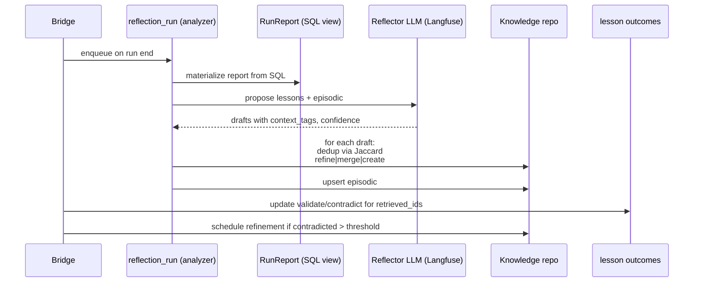

# Unified Observability, Knowledge, and Reflection Layer (Phase 2 Design)

> Supersedes the earlier "Logging + SQL Migration" draft. The scope now covers logs + LLM observability + knowledge store + reflection pipeline + interaction-time planning, treated as one layered system.

---

## 1) Executive Summary

This phase replaces file-based run logs and NDJSON memory with a layered stack:

- **Langfuse** is the single source of truth for everything LLM-related: prompts, responses, reasoning, tool calls, tokens, costs. Our database never stores LLM text — only **trace/observation IDs** that link out to Langfuse.
- **SQL (Postgres / SQLite)** is the source of truth for *game state, decisions, knowledge, and feedback* — the things we need to query, join, and reason over programmatically.
- **Knowledge layer** is a **first-class, continuously refined** store with explicit operations for create / validate / contradict / refine / generalize / merge / split / archive, versioned and queryable.
- **Interaction layer** adds a dedicated **Planner** model with its own retrieval chat history, plus an optional **ReAct Retrieval agent** that gathers + consolidates knowledge before handing a compact brief to the decision model.
- **Retrieval is no longer per-decision.** We move from "every scene change" to an event-driven policy that invalidates/refreshes plans only when the situation materially changes.

Decisions locked for this phase:

- Dual-engine SQL backend (Postgres + SQLite) behind one repository interface.
- Langfuse is **required** for LLM observability (was optional in v1); SQL has no LLM text columns.
- Knowledge entries are **versioned**; refinement mutates logical entries while preserving history.
- Planner and ReAct retrieval are separate graph nodes with their own conversation state and budget policy.
- Existing log files remain during transition; removed only after sustained parity.
- Frontend refactors deferred until backend parity is proven.

---

## 2) Scope and Non-Goals

### In scope

- New persistence schema (runs, frames, decisions, knowledge, retrievals, reflection runs, mutation events).
- Langfuse-first observability for every LLM call across decision / planner / strategist / compactor / reflector / consolidator.
- Continuously refined knowledge schema with versioning and explicit refinement operations.
- Secondary Planner node with retrieval tools and its own conversation thread.
- ReAct-style retrieval consolidator that condenses knowledge once per "plan epoch".
- Trigger policy controlling when planner / retrieval / strategist re-run.
- Backfill from existing `logs/games/`* and `data/memory/*.ndjson` into the new schema.
- Parity tooling comparing file-derived vs DB+Langfuse-derived outputs.
- Backend read cutover behind stable API shapes.

### Out of scope (this phase)

- Large frontend refactor (a new `/api/knowledge` surface will land, UI work follows later).
- Byte-exact reconstruction of historical JSON files.
- Embedding-based retrieval (schema hooks reserved; no vectors populated yet).
- Multi-process write coordination (we remain single-writer for the bridge).

---

## 3) Product Contract

### Functional reconstruction

We require enough SQL + Langfuse state to:

- reproduce the decision context for any frame,
- replay decisions and metrics,
- recompute the `RunReport` used by reflection,
- re-run reflection and consolidation deterministically,
- audit every knowledge mutation.

We do **not** require:

- byte-equivalent reconstruction of historical `*.json` / `*.ai.json` / NDJSON files,
- preserving intermediate `update_seq` decision revisions in SQL (terminal state only; full history lives in Langfuse).

### Storage principle


| Kind of data                                                                   | Home                                         | Why                                                      |
| ------------------------------------------------------------------------------ | -------------------------------------------- | -------------------------------------------------------- |
| Prompts, responses, reasoning, tool call args/results, token counts, latencies | **Langfuse**                                 | Native trace surface, UI, diffing, replay, cost analysis |
| IDs, game state projection, decisions, knowledge rows, tags, feedback, lineage | **SQL**                                      | Joinable, queryable, transactional, portable             |
| Full raw game-state envelope, large message bodies (if kept)                   | **Blob store** (content-addressed, optional) | Keeps SQL hot and small                                  |
| Markdown knowledge docs (edit surface)                                         | Git + ingested into SQL                      | Authorable, diffable, reproducible                       |


---

## 4) System Layers

```mermaid
flowchart TB
  subgraph Interaction[Interaction-time]
    T[Trigger policy]
    ReAct[ReAct Retrieval Agent<br/>(knowledge tools, separate thread)]
    Plan[Planner Model<br/>(separate chat history)]
    Dec[Decision Model]
  end

  subgraph Knowledge[Knowledge layer]
    KE[knowledge_entry<br/>versioned]
    KT[knowledge_entry_tag]
    KR[knowledge_revision]
  end

  subgraph Reflection[Reflection layer]
    RA[Run Analyzer<br/>(SQL view)]
    RF[Reflector LLM]
    RC[Consolidator]
    LO[Lesson outcomes / lineage]
  end

  subgraph Observability[Observability layer]
    LF[(Langfuse<br/>LLM SoT)]
    LC[llm_call table<br/>(IDs only)]
  end

  subgraph State[State layer]
    Runs[runs]
    Frames[run_frames]
    Dec2[agent_decisions]
    FR[frame_retrievals / hits]
  end

  T --> ReAct --> Plan --> Dec
  Plan -. reads .-> KE
  ReAct -. reads .-> KE
  Dec --> Frames
  Dec --> LC
  Plan --> LC
  ReAct --> LC
  LC -. links .-> LF
  Runs --> RA --> RF --> KE
  RC --> KE
  KE --> KR
  LO -. updates .-> KE
```


---

## 5) Observability Layer (Langfuse-first)

### 5.0 Langfuse-native traces and sessions (strict contract)

We **do not** define a parallel “logging shape” for LLM observability. The bridge and agent **must** follow Langfuse’s own **Trace** and **Session** semantics so Langfuse’s UI, public session links, APIs, and any tooling that keys off Langfuse fields behave exactly as Langfuse documents.

- **Trace:** Each logical unit in §5.1 maps to exactly one Langfuse **`trace_id`**. All generations, spans, tool round-trips, and validators for that unit are **observations on that trace** (Langfuse’s trace model).
- **Session:** A Langfuse **Session** groups **multiple traces** under one stable **`sessionId`** (Langfuse product field; see their Sessions feature). For this project, **one playable run** = **one session**: set **`sessionId` = `run_id`** where `run_id` is the stable id for the whole run (the same value we store as `runs.id` / `langfuse_session_id` in SQL). **`userId`** is set using Langfuse’s documented **`userId` / `user_id`** trace attribute (default for our deployment: same value as `run_id` unless we introduce a distinct operator identity).

**Wire-up requirement:** `sessionId` and `userId` **must** be attached using Langfuse-supported **trace-level** mechanisms for the SDK in use (e.g. Python **`propagate_attributes(session_id=..., user_id=...)`** around nested calls, or any successor API Langfuse documents for the same effect). Duplicating `"session_id"` / `"user_id"` **only** inside ad-hoc observation **metadata** JSON **does not** satisfy this contract and **must not** be treated as implementing Sessions.

**Normative references:**

- Sessions: https://langfuse.com/docs/observability/features/sessions  
- Observability / tracing overview (trace vs observation hierarchy, SDK links): https://langfuse.com/docs/observability/overview  

Custom fields (`state_id`, `frame_id`, `decision_id`, tags, etc.) remain **metadata** on observations or traces as appropriate (§5.2); they **supplement**, not replace, Langfuse **`sessionId`** / **`userId`**.

### 5.1 Langfuse as source of truth

Every LLM interaction produces exactly one Langfuse **trace** per logical unit and one **generation/observation** per round:


| Logical unit           | Trace scope                       | Observations per trace                                                                                                               |
| ---------------------- | --------------------------------- | ------------------------------------------------------------------------------------------------------------------------------------ |
| Per decision frame     | one trace per `decision_id`       | strategist (optional), compactor (optional), planner (if ran), retrieval ReAct subspans, decision (+ each tool roundtrip), validator |
| Per reflection run     | one trace per `reflection_run.id` | analyzer (rule-based span), reflector (generation), consolidator (span)                                                              |
| Per consolidation pass | one trace per pass                | one span (no LLM by default)                                                                                                         |


Every Langfuse trace **must** carry (per §5.0 — **trace-level** Langfuse fields, not only nested metadata):

- **`sessionId`** = stable **`run_id`** for the whole game run (same id as `runs.id` / `runs.langfuse_session_id`),
- **`userId`** = operator / run identity as above (default: same as `run_id`),
- tags: `agent_mode`, `character`, `act`, `floor`, `experiment_id`, `prompt_profile`,
- `langfuse.score`: attached from run outcome (`victory` = 1.0, `defeat` = 0.0, partial on incomplete), from lesson efficacy post-run, and from parity check results.

### 5.2 What leaves our code and goes to Langfuse

Langfuse receives:

- full system prompt (or a reference name + version when it is templated),
- full user prompt,
- full assistant message / reasoning summary / tool calls + results,
- token usage and cost,
- latency per call,
- custom metadata: `state_id`, `frame_id`, `decision_id`, `stage`, `reasoning_effort`, `prompt_profile`, `knowledge_version`, retrieved entry IDs.

### 5.3 What we keep in SQL: `llm_call` (IDs only)

```text
llm_call(
  id                         UUID PK,
  run_id                     FK runs.id,
  frame_id                   FK run_frames.id NULLABLE,
  decision_id                FK agent_decisions.id NULLABLE,
  reflection_run_id          FK reflection_runs.id NULLABLE,
  stage                      TEXT   -- decision|combat_plan|planner|strategist|react_retrieval|compactor|reflector
  round_index                INT,
  model                      TEXT,
  reasoning_effort           TEXT,
  input_tokens               INT,
  cached_input_tokens        INT,
  uncached_input_tokens      INT,
  output_tokens              INT,
  reasoning_tokens           INT,
  total_tokens               INT,
  latency_ms                 INT,
  status                     TEXT,   -- ok|error|timeout
  error_code                 TEXT,
  langfuse_trace_id          TEXT NOT NULL,
  langfuse_observation_id    TEXT NOT NULL,
  prompt_profile             TEXT,
  knowledge_version_id       UUID NULLABLE,  -- knowledge snapshot at call time
  created_at                 TIMESTAMPTZ
)
```

Rule: if a field is *text* and can change between calls, it lives in Langfuse. If it's a number, an enum, or an ID, it can live in SQL.

### 5.4 Outage/degraded-mode behavior

- If Langfuse is unreachable: LLM calls still succeed, `langfuse_trace_id` is set to a locally generated UUID with prefix `local-`, and a background job retries export. SQL is never blocked on Langfuse availability.
- Langfuse connection and sampling policy lives in config (`LANGFUSE_ENABLED`, `LANGFUSE_SAMPLE_RATE`, `LANGFUSE_REDACT_PROMPTS`).

---

## 6) State Layer (SQL Schema)

### 6.1 `runs`

```text
id PK, run_dir_name, seed, character_class, ascension_level,
started_at, ended_at, status (active|ended|incomplete),
storage_engine (postgres|sqlite),

-- reproducibility
system_prompt_hash, prompt_builder_version,
knowledge_version_id FK knowledge_version.id,
reference_data_hash, config_hash,

-- lifecycle
reflection_status (pending|running|succeeded|failed|skipped),

-- observability
langfuse_session_id,
experiment_id FK experiments.id NULLABLE,

source_log_path NULLABLE  -- backfill provenance
```

### 6.2 `run_frames`

Unique `(run_id, event_index)`.

Required: `run_id`, `event_index`, `state_id`, `screen_type`, `floor`, `act`, `turn_key`, `ready_for_command`, `agent_mode`, `ai_enabled`, `command_sent`, `command_source`, `action`, `is_floor_start` (computed), `vm_summary_json`, `meta_json`, `state_projection_json` (versioned; see §6.9).

Optional: `raw_state_blob_ref` (content hash + blob URI) — enabled by config for parity runs.

### 6.3 `agent_decisions`

Unique `(run_id, event_index)`. Terminal snapshot only.

Core: `run_id`, `event_index`, `decision_id`, `state_id`, `turn_key`, `status`, `approval_status`, `execution_outcome`, `final_decision`, `final_decision_sequence_json`, `validation_error`, `error`, `tool_names_json`, `prompt_profile`, `experiment_id`, `experiment_tag`, `strategist_ran`, `planner_ran`, `react_ran`, `deck_size`.

Removed (migrated to Langfuse or `llm_call`): `user_message`, `assistant_message`, all token/latency/model fields, `planner_summary`, `combat_plan_*`, `reasoning_effort_used`, `llm_model_used`.

Retained as *hash refs* (optional, for blob fallback): `user_message_sha256`, `assistant_message_sha256`.

### 6.4 `frame_retrievals` + `frame_retrieval_hits` (new)

Captures what knowledge was considered and why.

```text
frame_retrievals(
  id PK, run_id, frame_id, retrieval_epoch_id,
  selector (deterministic|strategist_llm|react_agent),
  context_tags_json, pool_size, k_selected,
  latency_ms,
  langfuse_trace_id NULLABLE, langfuse_observation_id NULLABLE,
  created_at
)
frame_retrieval_hits(
  retrieval_id, entry_id FK knowledge_entry.id, entry_version_id,
  layer, raw_overlap, weighted_score, rank, was_selected
)
```

`retrieval_epoch_id` (§8.4) lets many frames share one retrieval — critical for the new "not every decision" policy.

### 6.5 `reflection_runs`

```text
id PK, run_id, kind (analyzer|reflector|consolidator),
status (pending|running|succeeded|failed|skipped),
started_at, finished_at, error,
langfuse_trace_id NULLABLE,
model, reasoning_effort,
procedural_appended, procedural_merged, procedural_refined,
episodic_appended, archived_ids_json,
report_ref_blob NULLABLE   -- for large RunReports if we keep them; otherwise recomputable
```

### 6.6 `run_end`

`run_id` PK. Fields as in v1 (victory, score, screen_name, floor, act, gold, current_hp, max_hp, deck_size, relic_count, recorded_at).

### 6.7 `experiments` + `run_experiments`

```text
experiments(id, name, description, started_at, ended_at, config_hash,
            decision_model, reasoning_effort, prompt_profile, memory_weights_json)
run_experiments(run_id, experiment_id, bucket, variant)
```

### 6.8 `mutation_events` (audit)

One table, all writers, for knowledge + runs + reflection mutations.

```text
mutation_events(
  id, occurred_at, actor (bridge|planner|react|reflector|consolidator|operator|migration),
  target_kind, target_id, action, before_json, after_json,
  langfuse_trace_id NULLABLE
)
```

The former `consolidation_log.ndjson` becomes `where actor='consolidator'`.

### 6.9 JSON schema versioning

Every JSON blob column (`state_projection_json`, `vm_summary_json`, `meta_json`) has a sibling `*_schema_version` column. Reflection and replay refuse to process versions they do not recognize; migrations carry the upgrader.

---

## 7) Knowledge Layer (first class, continuously refined)

### 7.1 Today's limitation

Today the memory store supports only **append**, **status flip to archived** (consolidator), and **counter bump** on duplicate merge (`memory_storage._find_duplicate_lesson_index`). There is no way to rewrite a lesson, generalize two into one, split an overly-broad lesson, or record *why* a change happened. This is the single biggest blocker to continuous refinement.

### 7.2 Unified schema

```text
knowledge_entry(
  id PK,                       -- stable across refinements
  layer (strategy|procedural|episodic|expert),
  current_version_id FK knowledge_revision.id,
  status (active|archived|superseded|deprecated),
  confidence,                  -- nullable for strategy/episodic
  source_run_id NULLABLE,
  created_at, updated_at
)

knowledge_revision(
  id PK, entry_id FK,
  version_no,                  -- monotonic per entry
  body_text, body_hash,
  snippet,                     -- 120-char index text
  context_tags_snapshot_json,  -- denormalized for historical replay
  reason (creation|refinement|generalization|merge|split|contradiction|promotion|manual),
  produced_by (reflector|consolidator|planner|operator|migration),
  langfuse_trace_id NULLABLE,  -- LLM that proposed this revision
  created_at
)

knowledge_entry_tag(entry_id, tag_key, tag_value)   -- normalized (portable across SQLite/PG)
knowledge_entry_embedding(entry_id, model, vector)  -- reserved, unpopulated this phase

knowledge_lineage(parent_id, child_id, kind (merged_into|split_from|refined_from|supersedes))
```

```text
knowledge_version(
  id PK, taken_at, manifest_hash,
  strategy_count, procedural_count, episodic_count
)
```

Every run references a `knowledge_version_id`, so retrieval at replay time is reproducible even after later refinements.

### 7.3 Refinement operations (new)

All are performed via repository methods and emit `mutation_events`:


| Operation                                         | What it does                                                           | Revision reason              |
| ------------------------------------------------- | ---------------------------------------------------------------------- | ---------------------------- |
| `create(entry)`                                   | New lesson from reflector                                              | `creation`                   |
| `validate(entry_id, run_id)`                      | Bump `times_validated`; no revision                                    | —                            |
| `contradict(entry_id, run_id)`                    | Bump `times_contradicted`; if threshold exceeded, schedule refinement  | —                            |
| `refine(entry_id, new_body, rationale, trace_id)` | New revision, same entry_id, stays active                              | `refinement`                 |
| `generalize(entry_ids[], new_body, trace_id)`     | Create new entry; mark sources `superseded`; add `merged_into` lineage | `generalization`             |
| `split(entry_id, new_bodies[], trace_id)`         | Mark source `superseded`; create children with `split_from` lineage    | `split`                      |
| `merge(entry_ids[], survivor_id, trace_id)`       | Keep survivor; `superseded` losers; bump `times_validated` on survivor | `merge`                      |
| `archive(entry_id, reason)`                       | Status → `archived`; stops retrieval                                   | (status change, no revision) |
| `deprecate(entry_id)`                             | Soft-hide without archival (e.g., game patch invalidated it)           | (status change)              |
| `promote(entry_id, target_layer)`                 | Move procedural → strategy after many validations                      | `promotion`                  |


**Retrieval always reads `current_version` of `status='active'` entries.** History is preserved; rollbacks are cheap.

### 7.4 End-of-run knowledge pipeline




Key changes vs today:

- Duplicate detection can now **refine** (rewrite text) instead of dropping drafts on the floor.
- Contradictions can trigger a deferred *refinement run* rather than just bumping a counter.
- All of this is one Langfuse trace per run's reflection pipeline.

### 7.5 Efficacy scoring (derived view)

`v_lesson_efficacy` (materialized where supported):

```text
for each active procedural entry_id:
  uses                    = count(frame_retrieval_hits where was_selected)
  victory_uses            = count(... ∧ run.victory)
  validated_minus_contra  = times_validated - times_contradicted
  recency                 = avg(days since last selected) or null
  score                   = f(uses, victory_uses, validated_minus_contra, age, confidence)
```

Used to rank retrieval ties, prioritize refinement queue, and surface candidates for `promote`/`deprecate`.

---

## 8) Interaction Layer

The goal: stop paying the cost of strategist + retrieval + planning on every decision, while still giving the decision model rich context when it matters.

### 8.1 Current state (what exists)

- `run_strategist` node at `src/agent/strategist.py` runs on scene changes and combines retrieval selection + situation note + turn plan into one LLM call.
- `resolve_combat_plan` at `src/agent/planning.py` runs a combat planner turn 1+.
- `assemble_prompt` may call a *compactor* support model to shorten chat history.
- The decision model itself can call tools, so tool-assisted retrieval already exists there.

Everything above runs with overlapping responsibilities and re-executes frequently, inflating latency and token cost.

### 8.2 Proposed split


| Role                      | Model                                 | Owns                                                                                                 | Chat history                                                                |
| ------------------------- | ------------------------------------- | ---------------------------------------------------------------------------------------------------- | --------------------------------------------------------------------------- |
| **ReAct Retrieval agent** | support                               | Knowledge tools: `search_knowledge`, `get_entry`, `list_tags`, `expand_episodic`, `lookup_reference` | Its own short thread per *retrieval epoch*; thrown away after consolidation |
| **Planner**               | support (or decision with low effort) | Produces `plan_brief`: situation, 3-6 bullet plan, explicit do/avoid, open questions                 | Persistent thread keyed by `plan_epoch_id`, survives N frames               |
| **Decision**              | decision                              | Executes per-frame action, given compact brief + hard facts                                          | Per-turn conversation as today                                              |
| **Compactor**             | support                               | Compacts decision thread when token budget exceeded                                                  | Stateless                                                                   |


### 8.3 ReAct retrieval: gather → consolidate → brief

```mermaid
flowchart LR
  Q[Query context<br/>(tags, situation delta)] --> R[ReAct loop<br/>≤ N steps, budget-bounded]
  R -->|tool| K[Knowledge tools]
  K --> R
  R --> C[Consolidator output<br/>compact markdown brief]
  C --> P[Planner]
```


- Tool calls emit `frame_retrievals` + `frame_retrieval_hits` rows.
- Entire loop = one Langfuse trace with one observation per tool call.
- Output is a **consolidated brief** (target 400–800 tokens) with citations of `entry_id@version`. This is what the planner and decision model consume — **not** the raw hits.
- Caching: keyed by `(plan_epoch_id, context_digest)`. Same epoch + same situation = cached brief.

### 8.4 Plan epochs: "not every decision"

A **plan epoch** is a window during which the brief + plan remain valid. Triggers that end an epoch:


| Trigger                                         | Temporary threshold (revisit after Phase 4 telemetry) | Reason                       |
| ----------------------------------------------- | ----------------------------------------------------- | ---------------------------- |
| Floor change                                    | any increment                                         | Structural change in game    |
| Screen-type change (combat↔map↔event↔shop↔rest) | any transition                                        | Decision class changes       |
| New boss preview / elite revealed               | first time seen this act                              | New threats                  |
| HP drop since epoch start                       | ≥ 25% of max HP                                       | Plan assumptions invalidated |
| Relic / key potion acquired                     | any acquisition                                       | New capabilities             |
| Deck change since epoch start                   | ≥ 2 cards added or removed                            | Archetype drift              |
| Operator "replan"                               | manual                                                | Override                     |
| Staleness cap                                   | ≥ 12 decisions in epoch                               | Safety                       |
| Consecutive validation errors                   | ≥ 2 in a row                                          | Plan bad → force fresh       |


> Temporary decision: these thresholds are reasonable starting values, not tuned. They will be revisited after Phase 4 ships and we have epoch-duration and decision-quality telemetry.

Within an epoch:

- Decision model gets the cached plan brief + a tiny *delta block* describing what changed since epoch start.
- Planner and ReAct do **not** run; no strategist LLM call, no retrieval LLM call.
- Strategist in its current form is retired: retrieval selection moves to the ReAct agent (or a deterministic top-k when confidence is high), planning moves to the planner.

### 8.5 Planner chat thread

- Keyed by `plan_epoch_id`. Stored in `planner_threads` (optional sidecar table) with last `plan_brief`, last `plan_vector` of bullets, and `last_llm_call_id`.
- Langfuse gets one trace per planner turn, linked to the epoch.

**Continuity policy (temporary, revisit after Phase 4):**

The planner thread is either *restarted fresh* or *continued with an update turn*, chosen deterministically from the trigger that ended the epoch:


| Epoch-end trigger                     | Action                        | Why                                  |
| ------------------------------------- | ----------------------------- | ------------------------------------ |
| Floor change                          | **restart**                   | New territory; old plan likely stale |
| Screen-type change (e.g., combat→map) | restart                       | Different decision class             |
| Boss / elite revealed                 | restart                       | New strategic picture                |
| HP drop ≥ 25%                         | restart                       | Plan assumptions broken              |
| Relic / key potion acquired           | **continue** with update turn | Capabilities added, narrative intact |
| Card added to hand / added to deck    | continue with update turn     | Incremental drift                    |
| Deck change ≥ 2 cards                 | continue with update turn     | Narrative intact; just refresh       |
| Staleness cap (≥ 12 decisions)        | continue with update turn     | Stale but not broken                 |
| Consecutive validation errors         | restart                       | Plan is demonstrably bad             |
| Operator "replan"                     | restart                       | Human override                       |


> Temporary decision: the split above is the default. `PLANNER_CONTINUITY_OVERRIDE = always_restart | always_continue | by_trigger` exists in config for experimentation.
> A `continue` action sends the prior brief plus a *delta block* ("what changed since last brief") as one additional user turn and asks the planner for a revised brief — cheaper than a restart and preserves the planner's prior reasoning.

### 8.6 Decision-time inputs

What the decision model receives each frame:

1. Hard facts: header, legal actions, combat state, inventory (as today).
2. **Plan brief** (cached from planner).
3. **Delta block** (what changed since brief was produced).
4. At most **K=3 lesson snippets** — pre-picked by the ReAct consolidator, not re-retrieved.
5. No raw knowledge bodies at decision time.

This cuts most decisions to a single LLM round trip with smaller prompts.

### 8.7 Budget and back-pressure

Each stage declares a budget: max tokens, max tool calls, max latency. Exceeding any returns the best-so-far (ReAct: what it has; planner: last brief; decision: retry with reduced context). Budgets are tagged in Langfuse so cost regressions are visible.

---

## 9) Repository Interface

```python
# State + decisions
create_run(identity) -> run_id
insert_frame(run_id, event_index, payload)
upsert_decision_final(run_id, event_index, payload)
upsert_run_end(run_id, payload)

# LLM call IDs (Langfuse links)
record_llm_call(
  run_id, stage, langfuse_trace_id, langfuse_observation_id,
  tokens, latency_ms, model, reasoning_effort, frame_id=None, reflection_run_id=None
) -> llm_call_id

# Knowledge
create_entry(layer, body, tags, confidence, source_run, produced_by, trace_id) -> entry_id
refine_entry(entry_id, new_body, reason, produced_by, trace_id) -> revision_id
generalize_entries(entry_ids, new_body, produced_by, trace_id) -> new_entry_id
split_entry(entry_id, new_bodies, produced_by, trace_id) -> new_entry_ids
merge_entries(entry_ids, survivor_id, produced_by, trace_id)
archive_entry(entry_id, reason)
deprecate_entry(entry_id)
promote_entry(entry_id, target_layer)

validate_entry(entry_id, run_id)
contradict_entry(entry_id, run_id)

get_entry(entry_id, at_version=None)
retrieve_candidates(context_tags, layer_filter, min_confidence, limit) -> hits
record_retrieval(frame_id, selector, context_tags, hits, epoch_id, trace_id)

# Reflection
create_reflection_run(run_id, kind) -> reflection_run_id
complete_reflection_run(id, status, ...)
list_pending_reflection_runs()

# Reads
get_run_metrics(run_id)
get_frame(run_id, event_index)
get_frame_decision(run_id, event_index)
get_plan_epoch(run_id, frame_id)
list_runs(filters)
analyze_run_from_db(run_id)   # materializes RunReport via SQL views
```

Requirements:

- All writes idempotent (`(run_id, event_index)` etc.).
- Every mutation path emits a `mutation_events` row.
- Repository contract-tests run against both SQLite and Postgres.

---

## 10) Migration and Rollout

### Guiding rules

1. **Every phase ships behind feature flags and can be reverted by flipping a flag.** Only the final cleanup phase deletes code paths.
2. **Every phase ends with an observable, runnable test** — either a live smoke run, a replay benchmark, or a parity sweep over the existing log corpus.
3. **Files stay authoritative until a phase explicitly says otherwise.** SQL and Langfuse are added as shadows, then promoted, then files are retired last.
4. **Schema migrates forward only.** Every DDL change goes through Alembic; every JSON blob column has a sibling `*_schema_version`.
5. **One repository interface, two engines.** Every new behavior is covered by the repo contract test suite running against both SQLite and Postgres.

### Feature flag matrix (set per phase)


| Flag                          | Default                  | Purpose                             |
| ----------------------------- | ------------------------ | ----------------------------------- |
| `LANGFUSE_ENABLED`            | on from Phase 0          | Toggle all LLM tracing              |
| `LANGFUSE_SAMPLE_RATE`        | 1.0                      | Runtime sampling if needed          |
| `SQL_STATE_MODE`              | `off | shadow | primary` | State/decision write & read target  |
| `SQL_KNOWLEDGE_MODE`          | `off | shadow | primary` | Memory store write & read target    |
| `USE_PLANNER`                 | off                      | Enable planner node                 |
| `USE_REACT_RETRIEVAL`         | off                      | Enable ReAct retrieval node         |
| `PLANNER_CONTINUITY_OVERRIDE` | `by_trigger`             | Override continuity policy per §8.5 |
| `WRITE_LEGACY_FILE_LOGS`      | on until Phase 8         | Keep file writes during migration   |
| `WRITE_LEGACY_NDJSON`         | on until Phase 5         | Keep `data/memory/*.ndjson` writes  |


---

### Phase 0 — Foundations: Langfuse + SQL state scaffolding (shadow)

**Goal.** Every LLM call becomes observable in Langfuse; every frame and decision is shadow-mirrored to SQL. No behavior change.

**Scope.**

- Langfuse SDK installed; `LangfuseClient` wrapper with client-generated `trace_id` and `observation_id`, and **§5.0-compliant** propagation of Langfuse **`sessionId`** / **`userId`** on traces (not metadata-only duplicates).
- Instrument every LLM call site (decision, strategist, combat planner, compactor, reflector).
- Alembic initialized for both engines. Migration `0001_init`.
- Repo interface + dual-engine implementation for state tables.
- Shadow-write wired in `src/main.py` (frames) and `src/agent/tracing.py` (decisions + llm_calls).
- `mutation_events` write path live from day one.

**Schema migrations (`0001_init`).**

```text
runs, run_frames, agent_decisions, run_end, llm_call, mutation_events, experiments, run_experiments
```

Reproducibility hashes on `runs` added now (`system_prompt_hash`, `prompt_builder_version`, `reference_data_hash`, `config_hash`). `knowledge_version_id` exists as a nullable column; populated in Phase 3.

**Code hints.**

- New: `src/persistence/__init__.py`, `src/persistence/engine.py` (engine factory), `src/persistence/repository.py` (protocol), `src/persistence/sql_repository.py` (SQLAlchemy impl), `src/persistence/migrations/` (Alembic tree).
- New: `src/observability/langfuse_client.py` (wraps init, trace/observation helpers, redaction hook, local-fallback IDs; **must** satisfy **§5.0** for Langfuse-native traces + sessions).
- Touch: `src/agent/llm_client.py` — wrap every API call to emit Langfuse observation + return IDs to caller.
- Touch: `src/agent/graph.py`, `src/agent/strategist.py`, `src/agent/planning.py`, `src/agent/reflection/reflector.py` — each LLM call records its own `stage` metadata.
- Touch: `src/main.py` — on each frame and decision, call `repo.insert_frame` / `repo.upsert_decision_final` when `SQL_STATE_MODE != off`.

**Config.**

- `LANGFUSE_ENABLED=true`, `LANGFUSE_HOST`, `LANGFUSE_PUBLIC_KEY`, `LANGFUSE_SECRET_KEY`.
- `SQL_STATE_MODE=shadow`, `DATABASE_URL` (Postgres) and `SQLITE_PATH` (fallback).
- `WRITE_LEGACY_FILE_LOGS=true`.

**Tests.**

- Unit: `LangfuseClient` falls back to `local-` trace IDs when unreachable; no exception propagates.
- Unit: every `llm_call` stage appears in `llm_call` rows and carries both Langfuse IDs.
- Integration: play a short live or scripted run; assert Langfuse project has one trace per logical unit (§5.1) and SQL rowcounts match file counts.
- Contract: run repo test suite against both SQLite and Postgres; identical assertions.

**Exit criteria.**

- `pytest` green on contract suite for both engines.
- A full game run produces matching Langfuse traces and SQL rows for frames, decisions, and llm_calls.
- Flipping `SQL_STATE_MODE=off` produces unchanged file output (no unintended coupling).

**End-of-phase expectation.**
You can open Langfuse and see every model call the agent made in the last run, with cost/tokens/latency, and you can query SQL for the corresponding IDs. The agent itself behaves identically to before.

---

### Phase 1 — Backfill + parity tooling

**Goal.** Every historical run becomes queryable from SQL; we have automated parity checks.

**Scope.**

- Importer walks `logs/games/`* and writes `runs`, `run_frames`, `agent_decisions`, `run_end`, and `llm_call` rows (historical calls get `langfuse_trace_id='local-<uuid>'`).
- Importer is idempotent and resumable; tracks progress in a `backfill_jobs` table or operator-side manifest.
- `analyze_run_from_db(run_id)` materializes `RunReport` via SQL.
- Parity CLI: compares file-derived vs SQL-derived for each run on demand.

**Schema migrations (`0002_backfill`).**

```text
backfill_jobs(run_dir, stage, status, started_at, finished_at, error, rows_written_json)
```

**Code hints.**

- New: `scripts/backfill_logs.py` (CLI with `--logs-root`, `--run`, `--since`, `--dry-run`, `--resume`).
- New: `src/persistence/run_report_view.py` — pure-SQL materialization of `RunReport` structure from frames + decisions + run_end.
- New: `scripts/parity_check.py` — per-run diff (see §11).

**Transactional import (implementation detail).** Each run’s backfill uses one database transaction for all run-scoped rows (`runs`, `run_frames`, `agent_decisions`, `llm_call`, `run_end`, and the corresponding `mutation_events` with `actor=migration`). The `backfill_jobs` row is set to `pending` / `running` before that transaction starts; after commit it is updated to `succeeded` (or, on error, the transaction rolls back and the job row is updated to `failed` in a follow-up commit so progress is still visible). Large imports call `session.flush()` every `BACKFILL_FLUSH_EVERY_N_FRAMES` (default 50) inside the transaction to limit memory.

**Config.** Unchanged from Phase 0.

**Tests.**

- Importer idempotency: import the same run twice; row counts stable, no duplicates.
- Replay: pick three known runs (victory, defeat, incomplete); assert `analyze_run_from_db` output deep-equals file-derived `RunReport` modulo documented text-hashed fields.
- Parity CLI on whole log corpus: frame count / decision count / metrics summary match; report any drift.

**Exit criteria.**

- Parity CLI reports zero material drift across the entire `logs/games/` corpus.
- Backfill completes for every run directory currently in the repo.
- `/api/runs` endpoint can be flagged to read from SQL and returns byte-equivalent payloads (tested but not yet default).

**End-of-phase expectation.**
A fresh Postgres/SQLite instance, populated from files, answers every existing `/api/runs/`* query correctly behind a read flag. SQL is provably a mirror of the file log corpus.

---

### Phase 2 — Backend read cutover for state

**Goal.** Dashboard and replay endpoints read from SQL by default. File logs still written authoritatively.

**Scope.**

- `src/ui/dashboard.py` endpoints route reads through the repository when `SQL_STATE_MODE=primary`.
- Legacy file-read helpers kept as fallback and for cold starts.
- New endpoint `/api/llm_calls/{id}` returns the Langfuse deep link for UI use.
- `/api/runs/{run}/frames/{file_name}/ai_sidecar` payload shape preserved even though it's now assembled from SQL.

**Schema migrations.** None.

**Code hints.**

- Touch: `src/ui/dashboard.py` — every endpoint that currently reads `logs/games/<run>` gains a `repo.`* path.
- Touch: `src/eval/replay.py` — `summarize_run_directory`, `analyze_logs` gain repo-backed implementations selected by flag.

**Config.**

- Flip `SQL_STATE_MODE=primary` in dev/staging; `WRITE_LEGACY_FILE_LOGS=true` stays on.

**Tests.**

- Snapshot tests: every `/api/runs/`* response byte-equivalent between `SQL_STATE_MODE=shadow` (file-read) and `primary` (SQL-read) on a captured fixture corpus.
- Smoke: dashboard loads a run, replay page renders, map history renders — all against SQL.
- Regression: flipping flag back to `shadow` still works.

**Exit criteria.**

- All existing API contract tests pass with `SQL_STATE_MODE=primary`.
- Manual QA: operator UI looks and behaves identically.

**End-of-phase expectation.**
SQL is the read source for the dashboard and replay. Files remain on disk as the authoritative write target we can fall back to any time by flipping the flag.

---

### Phase 3 — Knowledge schema + ingestion (shadow)

**Goal.** A complete, versioned mirror of the current knowledge/memory state exists in SQL. Retrieval still happens from files.

**Scope.**

- Full knowledge schema lands (§7.2).
- One-time ingestion of `data/knowledge/*.md` (as `layer=strategy`, revision 1) and `data/memory/*.ndjson` (as `layer=procedural|episodic`, revision 1). Lineage empty.
- `knowledge_version` row is written at ingestion end, and at the start of every new run thereafter.
- `runs.knowledge_version_id` populated.
- `MemoryStore` gains a dual-path mode that retrieves from both files and SQL and asserts equality in shadow (logs on mismatch, does not fail the call).

**Schema migrations (`0003_knowledge`).**

```text
knowledge_entry, knowledge_revision, knowledge_entry_tag, knowledge_lineage,
knowledge_entry_embedding (schema only), knowledge_version
```

**Code hints.**

- New: `scripts/ingest_knowledge.py` — idempotent ingestion CLI.
- New: `src/persistence/knowledge_repository.py` — read helpers only at this stage (`get_entry`, `retrieve_candidates`, `snapshot_version`).
- Touch: `src/agent/memory/store.py` — add `RetrievalShadowMode` wrapping the existing `retrieve` with a SQL-side comparator.
- Touch: `src/main.py` — at run start, snapshot `knowledge_version` and set on `runs.knowledge_version_id`.

**Config.**

- `SQL_KNOWLEDGE_MODE=shadow`.
- `WRITE_LEGACY_NDJSON=true`.

**Tests.**

- Ingestion idempotency: re-running the script creates no new revisions, no duplicate tags.
- Retrieval shadow: replay N frames and assert `files top-k == sql top-k` for every frame (order-insensitive equality is fine).
- Reproducibility: two consecutive ingestions of unchanged files produce the same `manifest_hash`.

**Exit criteria.**

- Shadow retrieval is clean (no mismatches) across a 20-run replay.
- New live runs carry a `knowledge_version_id`.

**End-of-phase expectation.**
SQL contains every strategy doc and every lesson as a versioned row. Retrieval still runs from files but we have verified parity at every frame.

---

### Phase 4 — Reflection writes through the SQL knowledge repository

**Goal.** End-of-run reflection mutates knowledge through the SQL repository with full revision history and audit trail. NDJSON dual-write retained for rollback.

**Scope.**

- `reflection_runs` table populated.
- Reflector's duplicate-detection path now issues `refine_entry` (text update → new revision) instead of the counter-only merge; near-duplicates among same-batch drafts trigger `generalize_entries`.
- `update_lesson_outcomes` → `validate_entry` / `contradict_entry` repo calls.
- Consolidator → `archive_entry` via repo.
- NDJSON writes still on; SQL writes considered authoritative for the run just completed; on next run start, verify both stores agree.

**Schema migrations (`0004_reflection`).**

```text
reflection_runs (as per §6.5 with procedural_refined field)
```

**Code hints.**

- Touch: `src/agent/reflection/runner.py` — create a `reflection_runs` row before analyze; mark `status` transitions.
- Touch: `src/agent/reflection/memory_storage.py` — replace direct `MemoryStore.rewrite_procedural` with repo ops: `create_entry`, `refine_entry`, `generalize_entries`, `validate_entry`, `contradict_entry`. Keep the Jaccard duplicate-detection logic; only the effect changes.
- Touch: `src/agent/reflection/consolidator.py` — switch archival to `archive_entry`.
- New: `src/persistence/knowledge_repository_writer.py` — implements the §7.3 operations with `mutation_events` emission.

**Config.**

- `SQL_KNOWLEDGE_MODE=shadow` (reads still from files; writes now fan out to both).
- `WRITE_LEGACY_NDJSON=true`.

**Tests.**

- Unit per operation: `refine` creates a new revision with the correct `reason` and parent lineage; `generalize` creates one new entry and marks sources `superseded`; `split` preserves `split_from` lineage; `merge` keeps survivor history; `archive` flips status and no new revision.
- End-to-end: run a full reflection pipeline on a fixture RunReport; assert SQL state matches NDJSON file state (converting back).
- Audit: `mutation_events` contains one row per repository write with correct `actor` / `action`.

**Exit criteria.**

- For every run in a 10-run test corpus, SQL and NDJSON reflect the same active lesson set after reflection + consolidation.
- Synthetic refinement/merge/split round-trips pass.

**End-of-phase expectation.**
The agent now *refines* lessons instead of just accumulating them, with full history. The NDJSON files remain as a rescue path; SQL is ready to be promoted to primary.

---

### Phase 5 — Knowledge read cutover

**Goal.** `MemoryStore` reads from SQL. NDJSON is a cold backup.

**Scope.**

- `MemoryStore.retrieve` switches to SQL.
- Ingestion of strategy markdown becomes an on-change job: a watcher (or a manual CLI) re-ingests markdown files when their hash changes, creating a new `knowledge_revision` and bumping `knowledge_version`.
- NDJSON writes are suppressed at runtime; rollback re-enabled by flipping `WRITE_LEGACY_NDJSON=true`.

**Schema migrations.** None.

**Code hints.**

- Touch: `src/agent/memory/store.py` — `retrieve` uses `knowledge_repository`; `knowledge_index_entries` becomes an SQL read.
- Touch: `src/agent/strategist.py` — continues to work over the same `RetrievalHit` shape (no knowledge-shape change visible here).
- New: `scripts/reingest_knowledge.py` — re-ingest markdown on hash change.

**Config.**

- `SQL_KNOWLEDGE_MODE=primary`.
- `WRITE_LEGACY_NDJSON=false` (flip last, after a clean Phase 4 window).

**Tests.**

- Replay 20 runs; assert decisions are equivalent to Phase 4 runs (same knowledge, same retrievals).
- Edit one strategy markdown file; re-ingest; assert a new `knowledge_version` is created and that future runs record it.

**Exit criteria.**

- Full replay suite passes with `SQL_KNOWLEDGE_MODE=primary`.
- Operators can edit knowledge markdown and see the new version reflected within one run.

**End-of-phase expectation.**
Knowledge is fully SQL-native. Every run is tied to a specific knowledge version. We could delete the NDJSON tomorrow without losing data (we don't, yet).

---

### Phase 6 — Interaction: Planner + plan epochs (deterministic retrieval)

**Goal.** Introduce plan epochs and the planner node. Retrieval within an epoch is deterministic top-k; the strategist still runs as a fallback only when `USE_PLANNER=false`.

**Scope.**

- Plan-epoch state machine inside `SpireDecisionAgent`; triggers per §8.4.
- New graph node `planner` between `assemble_prompt` and `run_agent`; it runs only at epoch boundaries.
- `planner_threads` table (optional sidecar keyed by `plan_epoch_id`).
- `frame_retrievals` + `frame_retrieval_hits` populated by a deterministic top-k call at each epoch start (no ReAct yet).
- Continuity policy per §8.5 table.
- Decision prompt adds the plan brief + delta block; removes inline raw memory bodies.

**Schema migrations (`0005_planning`).**

```text
plan_epochs(id, run_id, started_frame_id, ended_frame_id NULLABLE,
            trigger_kind, continuity_action, brief_ref_llm_call_id)
planner_threads(plan_epoch_id, last_brief_text_hash, last_llm_call_id, turn_count)
frame_retrievals, frame_retrieval_hits (as §6.4)
```

**Code hints.**

- New: `src/agent/planner.py` — planner node, brief schema, delta-block renderer.
- New: `src/agent/epochs.py` — trigger evaluator, epoch id lifecycle, continuity dispatcher.
- Touch: `src/agent/graph.py` — insert `planner` node; `assemble_prompt` consumes `trace.plan_brief` + `trace.delta_block`.
- Touch: `src/agent/prompt_builder.py` — no raw memory bodies in the decision prompt; use pre-picked K≤3 snippets from the brief.

**Config.**

- `USE_PLANNER=true` in staging; `false` in production until benchmark passes.
- `PLANNER_CONTINUITY_OVERRIDE=by_trigger`.
- `PLANNER_MAX_EPOCH_DECISIONS=12` (staleness cap per §8.4).

**Tests.**

- Unit: epoch trigger evaluator — given a synthetic sequence of VM states, emit the documented epoch boundaries exactly.
- Unit: continuity dispatcher — given a trigger, produce correct `restart` vs `continue` action.
- Integration: replay a known run under `USE_PLANNER=true`; assert no decision frame lacks a brief; assert at most one planner LLM call per epoch.
- Benchmark: fixed-seed suite (e.g., 20 seeds × 3 characters) replayed under Phase 5 baseline and Phase 6. Report win rate, average tokens-per-decision, average decisions-per-epoch. Gate: win rate no worse than baseline within a defined confidence interval.

**Exit criteria.**

- Benchmark win rate ≥ baseline.
- Average LLM token spend per run decreases (target ≥ 30% reduction on combat-heavy runs).
- Epoch boundaries are observable in SQL and map cleanly to the VM event stream.

**End-of-phase expectation.**
Decisions within an epoch are cheap and fast; planner runs only when something structural changes. Strategist still exists but is only used when the flag is off.

---

### Phase 7 — Interaction: ReAct retrieval + strategist retirement

**Goal.** Replace deterministic top-k with a ReAct retrieval agent that gathers and consolidates knowledge into a brief with citations. Strategist is removed.

**Scope.**

- `react_retrieve` node before `planner` at epoch boundaries.
- Knowledge tools exposed to the support model: `search_knowledge(tags, limit)`, `get_entry(entry_id, at_version)`, `list_tags(prefix)`, `expand_episodic(run_filters)`, `lookup_reference(card|relic|event name)`.
- ReAct loop bounded by `REACT_MAX_STEPS` and token budget.
- Output: a consolidated brief (≤800 tokens) with `entry_id@version` citations; stored in Langfuse and referenced on `plan_epochs` via the brief's `llm_call_id`.
- `strategist` node removed from the graph; dead code deleted.

**Schema migrations.** None (frame_retrievals already exists; `selector='react_agent'` from Phase 6 onward).

**Code hints.**

- New: `src/agent/react_retrieval.py` — loop driver, tool dispatch, consolidation formatter.
- New: `src/agent/tools/knowledge_tools.py` — tool definitions wired into `tool_registry`.
- Touch: `src/agent/graph.py` — insert `react_retrieve` node; remove `run_strategist` node; delete `src/agent/strategist.py` after the benchmark passes.
- Touch: `src/agent/prompts/` — new `react_retrieval_prompt.md`, new `planner_prompt.md`.

**Config.**

- `USE_REACT_RETRIEVAL=true`.
- `REACT_MAX_STEPS=6`, `REACT_TOKEN_BUDGET=4000`.

**Tests.**

- Unit per tool: each knowledge tool returns a stable JSON schema; budget enforcement fires at limits.
- Integration: replay benchmark Phase 6 vs Phase 7 on the same fixed-seed suite. Gate: win rate no worse than Phase 6; brief citation coverage ≥ 80% of briefs cite at least one entry.
- Sampled operator review: N=10 briefs manually read for relevance and hallucinated citation rate.
- Langfuse: every ReAct trace has one observation per tool call; `frame_retrievals.selector='react_agent'`.

**Exit criteria.**

- Benchmark win rate ≥ Phase 6.
- Hallucinated-citation rate < 2%.
- Token spend per epoch within configured budget on ≥ 95% of epochs.

**End-of-phase expectation.**
The agent explicitly reasons about what knowledge to fetch, then produces a compact, cited brief that drives planning and decisions. Strategist is gone; the graph is `react_retrieve → planner → (cached brief across frames) → assemble_prompt → run_agent → validate_decision`.

---

### Phase 8 — Cleanup and file deprecation

**Goal.** Delete redundant file-write paths, tighten retention, and close the migration.

**Scope.**

- After two clean weeks on Phase 7: set `WRITE_LEGACY_FILE_LOGS=false`; stop writing `*.json`, `*.ai.json`, `run_metrics.ndjson`, `run_end_snapshot.json`.
- Archive existing `logs/games/`* to cold storage.
- Remove the legacy file-read fallback paths from `src/ui/dashboard.py` and `src/eval/replay.py`.
- Introduce blob store for large text previously kept on disk (optional raw state, full prompts if any are still kept locally).
- Retention job for `mutation_events` and old `knowledge_revision` history if needed.

**Schema migrations.** None required; possibly `0006_blob_refs` if the blob columns are added.

**Code hints.**

- Delete: file log helpers in `src/agent/tracing.py` (`write_ai_log`, `append_*_run_metric` once all call sites removed).
- Touch: `src/main.py` — no file writes except during emergency debug flag.

**Config.**

- `WRITE_LEGACY_FILE_LOGS=false`.

**Tests.**

- Smoke: run end to end; assert no writes under `logs/games/` (other than the optional archive).
- Disk footprint check: bridge produces ≤ X MB/hour of local files (should be near zero).

**Exit criteria.**

- No endpoint reads files; no code path writes the legacy sidecars.
- All tests green on a fresh checkout.

**End-of-phase expectation.**
The system runs on SQL + Langfuse alone. Files remain only as historical archive.

---

### Frontend follow-up (separate track)

Not a prerequisite for any phase above. Once Phase 5–7 are stable, land:

- `/metrics/knowledge` — browse entries, revisions, lineage.
- `/metrics/reflection` — list `reflection_runs`, drill into drafts, link to Langfuse.
- `/metrics/epochs` — visualize plan epochs per run, link frames to briefs.

---

## 11) Validation Strategy (cross-cutting invariants)

These are the tools and invariants that every phase maintains, rather than phase-specific tests.


| Invariant                        | Tool / check                                                                                                   |
| -------------------------------- | -------------------------------------------------------------------------------------------------------------- |
| Repository parity across engines | `pytest tests/persistence/contract_test.py` runs against SQLite and Postgres; CI fails if any case diverges    |
| State parity (files vs SQL)      | `scripts/parity_check.py --run <name>`: frame hashes, decision payloads, `RunReport` deep-equal                |
| Reflection parity                | Same `RunReport` fed through reflector twice (file-store vs SQL-store) produces equal drafts                   |
| Knowledge retrieval parity       | Replay suite asserts top-k equality between files and SQL while both exist                                     |
| Langfuse coverage                | Every `llm_call` row has a reachable `langfuse_trace_id` (or documented `local-` prefix)                       |
| Epoch correctness                | Replay asserts epoch boundaries match documented triggers deterministically                                    |
| Refinement round-trip            | Synthetic: create → refine → generalize → split → merge → archive → verify lineage reconstructs the full graph |
| Audit completeness               | Every repository mutation produces exactly one `mutation_events` row                                           |
| Rollback safety                  | Flipping any `SQL_*_MODE` flag back to `shadow` or `off` never breaks the dashboard or bridge                  |


Each tool is committed to the repo and runnable by a single command; parity and benchmark runs are wired into CI for Phases 1, 2, 4, 5 and run on demand for Phases 6, 7.

---

## 12) Risks and Mitigations


| Risk                                       | Mitigation                                                                                                                                                         |
| ------------------------------------------ | ------------------------------------------------------------------------------------------------------------------------------------------------------------------ |
| Langfuse outage blocks LLM calls           | Never block; `local-` trace IDs + retry exporter                                                                                                                   |
| Knowledge refinement introduces regression | Every refinement preserves prior revision; rollback is a one-column update                                                                                         |
| Planner + ReAct increase latency           | Epoch caching; strict budgets; planner skipped if epoch valid                                                                                                      |
| Dual-engine SQL drift                      | Repository contract tests run on both engines per PR                                                                                                               |
| Strategist removal breaks decisions        | Replay-benchmark on fixed seeds before ship; rollback via git revert if needed                                                                                     |
| Reflection pipeline stalls                 | `reflection_runs.status` timeouts + retries; observable via `/api/reflection/`*                                                                                    |
| Over-refinement of good lessons            | `knowledge_revision` preserves every prior version; rollback is a one-column flip of `current_version_id`; manual operator approval lane available if needed later |
| Knowledge tag explosion                    | Tag cardinality monitoring; slug canonicalization reused from `tag_utils`                                                                                          |


---

## 13) Open Items and Temporary Decisions

### 13.1 Locked-for-now (temporary, revisit after Phase 4 telemetry)


| Item                                                                     | Current value                                                                           | Where |
| ------------------------------------------------------------------------ | --------------------------------------------------------------------------------------- | ----- |
| Epoch-end thresholds (HP drop, deck delta, staleness, validation errors) | 25% HP, ≥2 cards, 12 decisions, 2 consecutive errors                                    | §8.4  |
| Planner continuity mapping per trigger                                   | `restart` on floor/screen/boss/HP/errors; `continue` on relic/card/deck drift/staleness | §8.5  |
| Strategist retirement                                                    | direct cutover in Phase 4, no A/B flag                                                  | §10   |


### 13.2 Still open

1. **Lesson promotion**: what's the bar to move a procedural entry into the `strategy` layer?
2. **Retention**: how long do we keep `mutation_events`, `knowledge_revision` history, and planner threads?
3. **Redaction**: any prompt redaction before shipping to Langfuse? (Leaning no; config hook exists.)
4. **Blob store choice**: local filesystem under `logs/blobs/` vs S3-compatible; content-addressed by SHA-256.
5. **Consolidator under versioning**: archive the entry or archive only the current revision?
6. **Expert layer**: introduce an operator-authored expert layer now, or reserve the slot?
7. **Embedding plan**: model choice when we eventually populate `knowledge_entry_embedding`.
8. **ReAct budgets**: max steps per call, token budget per epoch.

---

## 14) One-Line Summary

Unify logs, LLM observability, knowledge store, and reflection under a stack where **Langfuse owns all LLM text**, **SQL owns all queryable state and a versioned knowledge graph with explicit refinement operations**, and a new **Planner + ReAct Retrieval** layer amortizes expensive planning across multi-frame epochs so the decision model runs small and fast most of the time.