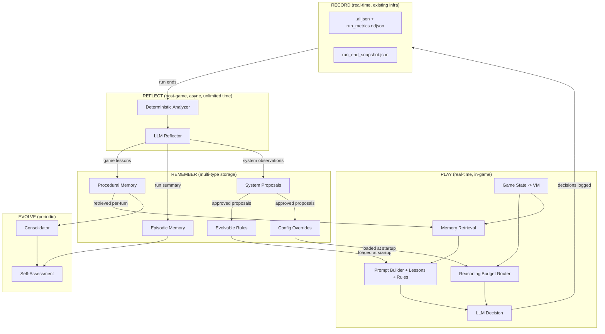

# Self-Evolving Agent: Overarching Improvement Plan

This is a living plan. Each phase builds on the previous one. We add capabilities incrementally and validate before moving forward.

## Philosophical Foundation

**The system IS the agent.** An LLM on its own has no long-horizon planning. But a system that plays, records, reflects, remembers, and evolves its own behavior over time -- that system exhibits genuine long-horizon intelligence. The measure of success is not any single decision, but the **rate at which the system stops repeating mistakes and discovers better strategies**.

This is grounded in validated research patterns:

- **Reflexion** (Shinn et al.): Verbal reinforcement learning -- agents store natural-language reflections in episodic memory to avoid repeating mistakes. 91% pass@1 on HumanEval vs GPT-4's 80%.
- **Voyager** (MineDojo): Ever-growing skill library where verified behaviors compound capabilities. 3.3x more unique items, 15.3x faster milestones.
- **ReMe** (Remember Me, Refine Me): Dynamic procedural memory with distillation, context-adaptive retrieval, and utility-based pruning. Smaller models + ReMe outperform larger memoryless models.

## System Architecture




## Five Evolution Dimensions

The reflection pipeline is the single engine that drives ALL evolution. Each run produces not just game lessons, but observations about how the system itself performed. Different output types feed different evolution pathways.

### Dimension 1: Game Knowledge (Procedural + Episodic Memory)

What the LLM knows about Slay the Spire. Lessons like *"Against Gremlin Nob, avoid playing skills in the first 2 turns"* stored as tagged entries, retrieved into prompts at decision time.

### Dimension 2: Reasoning Budget (Adaptive Effort + Model Routing)

How much compute to spend on each decision. The system learns that boss fights need `high` effort while hallway combats need `low`, and that Act 1 reward screens deserve more thought than Act 3 (where the deck is already defined).

### Dimension 3: Prompt Structure (Prompt Proposals)

Whether the prompt gives the LLM the right information in the right structure. The reflector can observe *"In this boss fight, the model had no information about remaining draw pile order -- adding draw pile preview would help planning"* and emit a prompt proposal.

### Dimension 4: Decision Heuristics (Evolvable Rules)

The deterministic rules that the harness uses outside the LLM -- deck archetype detection, pathing heuristics, combat plan triggers, short-circuit conditions. Currently hardcoded; evolved to be data-driven and refineable by the reflection system.

### Dimension 5: System Self-Assessment (Meta-Learning)

The system evaluates whether it is actually improving. Tracks learning rate, mistake recurrence, lesson validation rate, and configuration stability. Detects stagnation and signals when human intervention is needed.

---

## Phase A: Core Learning Loop

**Goal**: The system remembers what it learned and applies it next game. This is the foundation everything else builds on.

### Tiered Memory Design

- **Working Memory** = `TurnConversation.messages` + `action_history` + `combat_plan_guide` (ALREADY EXISTS)
- **Procedural Memory** = Learned rules/heuristics from reflection, stored as tagged NDJSON entries (NEW)
- **Episodic Memory** = Run summaries with outcomes, for pattern detection (NEW)
- **Semantic Memory** = `data/processed/*.json` + `data/strategy/curated_strategy.md` + `data/expert_guides/` (EXISTS, optionally extended)

### Data Models

```python
@dataclass
class ProceduralEntry:
    id: str
    created_at: str
    source_run: str
    lesson: str                # natural language lesson
    context_tags: dict         # {act, floor_range, screen, enemy, event, deck_archetype, ...}
    confidence: float          # 0.0-1.0, grows with cross-run validation
    times_validated: int
    times_contradicted: int
    status: str                # "active" | "weakened" | "archived"

@dataclass
class EpisodicEntry:
    id: str
    run_dir: str
    timestamp: str
    character: str
    outcome: str               # "victory" | "defeat"
    floor_reached: int
    cause_of_death: str | None
    deck_archetype: str
    key_decisions: list[str]   # pivotal moments
    run_summary: str           # one-paragraph narrative
```

### Storage Layout

All under `data/memory/` (runtime-created):

- `procedural.ndjson` -- Learned rules (the "skill library")
- `episodic.ndjson` -- Run narratives with outcomes
- `consolidation_log.ndjson` -- Audit trail of memory changes

### Reflection Pipeline

Triggered when a game ends (from [main.py](src/main.py) after `run_end_snapshot`). No time pressure -- this runs async after the game.

**Step 1 -- Deterministic Analyzer** ([src/agent/reflection/analyzer.py](src/agent/reflection/analyzer.py))

Loads all `.ai.json` files, `run_metrics.ndjson`, and `run_end_snapshot.json` from the run. Produces a `RunReport`:

- Win/loss, floor reached, character, score
- Decision chain: each AI decision linked to context and subsequent outcome
- Resource trajectory: HP, gold, potions over floors
- Deck evolution: cards added/removed/transformed and when
- Combat stats: damage dealt vs taken, turns per fight
- Key inflection points: decisions after which outcomes shifted
- Mistakes detected: model chose against stated reasoning, or outcome clearly negative
- Reasoning budget usage: effort level and model used per decision, correlated with decision quality and latency

**Step 2 -- LLM Reflector** ([src/agent/reflection/reflector.py](src/agent/reflection/reflector.py))

Receives `RunReport` + raw `.ai.json` excerpts for the most impactful decisions. The reflector (uses `reasoning` model slot, unlimited time) produces:

- 3-10 **procedural lessons** with context tags and confidence annotations
- 1 **episodic summary** of the run
- 1-3 **system observations** about harness effectiveness (optional, used in Phase C)

**Step 3 -- Memory Storage**

New lessons and summary appended to respective NDJSON files.

### Memory Retrieval (In-Game)

Lightweight step inside existing `_build_prompt` in [graph.py](src/agent/graph.py):

1. Extract **context tags** from current VM: act, floor, screen_type, enemy/boss name, event name, deck archetype (from card type ratios), held relics
2. **Tag-based search** over procedural memory: filter by tag overlap, score by overlap count * confidence
3. **Top-K selection**: Top 5-8 lessons (budget ~300-500 tokens)
4. **Expert guide fallback**: If fewer than 3 procedural hits, also search `data/expert_guides/` by matching YAML frontmatter tags
5. **Inject into prompt**: New "Lessons from past experience" subsection in user prompt, after strategy memory, before legal actions

Adds negligible latency (file read + simple matching, no embeddings).

### Expert Guides (Bootstrap Knowledge)

`data/expert_guides/` seeds the system before it has played enough runs. Markdown files with YAML frontmatter tags:

```yaml
---
tags: [act1, elites, deck_building, ironclad]
---
# Act 1 Elite Strategy for Ironclad
...
```

### Consolidation

Runs every N games (configurable, default 5) via [src/agent/reflection/consolidator.py](src/agent/reflection/consolidator.py):

- **Merge**: Group lessons with overlapping tags + similar content; LLM merges into single stronger lesson
- **Promote**: Lessons validated across 3+ runs get confidence boost
- **Weaken**: Lessons contradicted by recent evidence get confidence reduced
- **Archive**: Lessons below confidence threshold (0.2) get `status: "archived"`, excluded from retrieval
- **Log**: All actions recorded in `consolidation_log.ndjson`

### Phase A File Changes

**New files:**

- `src/agent/memory/__init__.py` -- package init
- `src/agent/memory/types.py` -- `ProceduralEntry`, `EpisodicEntry` (+ `SystemProposal`, `ReasoningProfile` stubs for later phases)
- `src/agent/memory/store.py` -- `MemoryStore` class: NDJSON load/save, tag search, top-K retrieval, add/archive
- `src/agent/reflection/__init__.py` -- package init
- `src/agent/reflection/analyzer.py` -- `RunAnalyzer` producing `RunReport`
- `src/agent/reflection/reflector.py` -- `Reflector` generating lessons + summary
- `src/agent/reflection/consolidator.py` -- `Consolidator` for periodic memory maintenance
- `src/agent/reflection/runner.py` -- `ReflectionRunner` orchestrating the pipeline
- `data/expert_guides/` -- directory with example guide file

**Modified files:**

- [src/agent/config.py](src/agent/config.py) -- add `memory_dir`, `reflection_enabled`, `reflection_model_key`, `consolidation_every_n_runs`, `max_lessons_per_prompt`, `expert_guides_dir`
- [src/agent/graph.py](src/agent/graph.py) -- memory retrieval in `_build_prompt`, pass lessons to prompt builder
- [src/agent/prompt_builder.py](src/agent/prompt_builder.py) -- new "Lessons from past experience" subsection
- [src/agent/session_state.py](src/agent/session_state.py) -- add `retrieved_lessons: list[str]`
- [src/main.py](src/main.py) -- post-run reflection hook after game end
- [src/agent/schemas.py](src/agent/schemas.py) -- add `lessons_retrieved`, `lessons_text_preview`, `reasoning_effort_used` to `AgentTrace` / `PersistedAiLog`
- [src/agent/tracing.py](src/agent/tracing.py) -- include new fields in persisted log output

---

## Phase B: Adaptive Reasoning Budget

**Goal**: Spend more compute on decisions that matter, less on routine ones. Learn the right budget from outcome data.

**Prerequisite**: Phase A (the analyzer already captures reasoning effort per decision and correlates with outcomes).

### Reasoning Budget Router

New module [src/agent/reasoning_budget.py](src/agent/reasoning_budget.py) with a `ReasoningBudgetRouter` class.

Currently, [graph.py](src/agent/graph.py) has `_resolve_turn_model_key` which picks `reasoning` vs `fast` model based on whether we are in combat. This is a binary switch. The router replaces it with a multi-dimensional lookup:

```python
@dataclass
class ReasoningProfile:
    name: str                  # "boss_fight", "act1_reward", "hallway_combat", ...
    model_key: str             # "reasoning" | "fast"
    reasoning_effort: str      # "low" | "medium" | "high"
    description: str           # human-readable explanation
    match_conditions: dict     # {screen, act, floor_range, enemy_type, ...}
    priority: int              # higher = checked first (specific beats general)
```

### Default Profile Table

Shipped with sensible defaults, refined by Phase C reflection:

- **Boss fights** (screen=COMBAT, enemy_type=boss): `reasoning` model, effort=`high`
- **Elite fights** (screen=COMBAT, enemy_type=elite): `reasoning` model, effort=`high`
- **Hallway combats** (screen=COMBAT, enemy_type=hallway): `fast` model, effort=`medium`
- **Act 1 card rewards** (screen=REWARD, act=1, reward_type=card): `reasoning` model, effort=`high` -- early deck building is critical
- **Act 3 card rewards** (screen=REWARD, act=3, reward_type=card): `fast` model, effort=`medium` -- deck is mostly defined
- **Map path choices** (screen=MAP): `reasoning` model, effort=`medium`
- **Events with 3+ options** (screen=EVENT, option_count>=3): `reasoning` model, effort=`medium`
- **Events with 1-2 options** (screen=EVENT, option_count<3): `fast` model, effort=`low`
- **Shop** (screen=SHOP): `reasoning` model, effort=`medium`
- **Simple rewards** (screen=REWARD, single_choice): `fast` model, effort=`low`
- **Fallback**: `reasoning` model, effort=`medium`

### Resolution Logic

```python
class ReasoningBudgetRouter:
    def __init__(self, default_profiles: list[ReasoningProfile],
                 override_file: Path | None = None):
        # Load defaults, then overlay any learned overrides from Phase C
        ...

    def resolve(self, vm: dict) -> ReasoningProfile:
        # Extract context from VM (screen, act, floor, enemy_type, option_count...)
        # Match against profiles in priority order
        # Return first match, else fallback
        ...
```

### Integration Points

- [graph.py](src/agent/graph.py): Replace `_resolve_turn_model_key` with `self.budget_router.resolve(vm)`. The resolved profile provides both `model_key` and `reasoning_effort`.
- [llm_client.py](src/agent/llm_client.py): `run_streaming_turn` accepts an optional `reasoning_effort` override parameter, used instead of the global config value when provided.
- [schemas.py](src/agent/schemas.py) + [tracing.py](src/agent/tracing.py): Record `reasoning_profile_name` and `reasoning_effort_used` in `AgentTrace` and `PersistedAiLog` for Phase C analysis.

### Phase B File Changes

**New files:**

- `src/agent/reasoning_budget.py` -- `ReasoningBudgetRouter`, `ReasoningProfile`, default profile table

**Modified files:**

- [src/agent/graph.py](src/agent/graph.py) -- replace `_resolve_turn_model_key` with router, pass resolved effort to LLM
- [src/agent/llm_client.py](src/agent/llm_client.py) -- accept per-call `reasoning_effort` override
- [src/agent/config.py](src/agent/config.py) -- add `reasoning_budget_enabled` flag
- [src/agent/schemas.py](src/agent/schemas.py) + [src/agent/tracing.py](src/agent/tracing.py) -- record profile name and effort used

---

## Phase C: Harness Evolution

**Goal**: The reflection pipeline not only teaches the LLM game knowledge but also proposes improvements to the harness itself -- heuristic rules, configuration, and prompt structure.

**Prerequisite**: Phase A + B running for 10-20 games, providing enough outcome data for meaningful system-level observations.

### Extended Reflector Output

The LLM Reflector's prompt is extended to ask three questions instead of one:

1. **Game knowledge**: What should the LLM remember for similar situations? (produces `ProceduralEntry`, same as Phase A)
2. **System effectiveness**: Was the harness well-configured? Right model/effort for each decision? Right information in the prompt? Anything missing or wasted? (produces `SystemProposal`)
3. **Pattern detection**: Any recurring cross-run patterns that suggest a systematic change? (produces `SystemProposal`)

### SystemProposal Data Model

```python
@dataclass
class SystemProposal:
    id: str
    created_at: str
    source_run: str
    proposal_type: str         # "heuristic_rule" | "config_override" | "prompt_suggestion"
    description: str           # human-readable explanation
    proposed_change: dict      # structured change payload (varies by type)
    evidence: str              # what in the run data supports this
    confidence: float          # 0.0-1.0
    status: str                # "proposed" | "approved" | "applied" | "rejected"
```

### Three Proposal Types

**Heuristic Rule Proposals** (`proposal_type: "heuristic_rule"`)

Currently `session_state.update_strategy_memory` has hardcoded rules (deck archetype detection at 60% threshold, pathing heuristics, etc.). Phase C makes these data-driven:

- Rules stored in `data/memory/heuristic_rules.ndjson`
- Loaded at agent startup by new module `src/agent/evolvable_rules.py`
- `session_state.update_strategy_memory` reads from the rule store instead of hardcoded logic
- Reflector proposes new rules or modifications to existing ones
- New proposals start as `status: "proposed"` -- initially human-reviewed, later auto-applied above a confidence threshold

Example proposal:

```json
{
  "proposal_type": "heuristic_rule",
  "description": "Lower attack-heavy deck threshold from 60% to 50%",
  "proposed_change": {"rule_id": "deck_archetype_attack", "field": "threshold", "old": 0.6, "new": 0.5},
  "evidence": "In 4/5 recent runs, decks with 50-60% attacks behaved as attack-heavy but were not classified as such"
}
```

**Config Override Proposals** (`proposal_type: "config_override"`)

The Phase B reasoning budget router ships with a default profile table. Phase C allows the reflector to propose learned overrides:

- Stored in `data/memory/config_overrides.ndjson`
- Loaded by `ReasoningBudgetRouter` as overlay on top of defaults
- Reflector correlates reasoning effort with decision quality from the `RunReport`

Example proposal:

```json
{
  "proposal_type": "config_override",
  "description": "Use high effort for Act 1 event choices -- early events shape the run",
  "proposed_change": {"profile": "act1_events", "match": {"screen": "EVENT", "act": 1}, "effort": "high"},
  "evidence": "In 3 runs, poor Act 1 event choices (made with effort=low) led to suboptimal relics/cards"
}
```

**Prompt Suggestions** (`proposal_type: "prompt_suggestion"`)

The reflector can observe what information was missing or unused in the prompt:

- Stored in `data/memory/prompt_proposals.ndjson`
- Human-reviewed (prompt changes are high-impact, not auto-applied)
- Tracks whether the suggestion was applied and what happened after

Example proposal:

```json
{
  "proposal_type": "prompt_suggestion",
  "description": "Add top-5 draw pile preview in boss combat prompts for better turn planning",
  "evidence": "Model made suboptimal play order in 2 boss fights where knowing upcoming draws would have changed sequencing"
}
```

### Phase C File Changes

**New files:**

- `src/agent/evolvable_rules.py` -- `RuleStore` class: load rules from NDJSON, provide query interface for `session_state`

**New data files (runtime-created):**

- `data/memory/heuristic_rules.ndjson`
- `data/memory/config_overrides.ndjson`
- `data/memory/prompt_proposals.ndjson`
- `data/memory/system_proposals.ndjson` (all proposals before routing to specific files)

**Modified files:**

- [src/agent/reflection/reflector.py](src/agent/reflection/reflector.py) -- extended prompt generating `SystemProposal` outputs
- [src/agent/session_state.py](src/agent/session_state.py) -- `update_strategy_memory` reads from `RuleStore` instead of hardcoded logic
- [src/agent/reasoning_budget.py](src/agent/reasoning_budget.py) -- `ReasoningBudgetRouter` loads overrides from `config_overrides.ndjson`
- [src/agent/reflection/runner.py](src/agent/reflection/runner.py) -- routes proposals to appropriate NDJSON files

---

## Phase D: Self-Assessment

**Goal**: The system evaluates whether it is actually getting better. Detects stagnation, validates that lessons and proposals are helping, and surfaces evolution metrics.

**Prerequisite**: 20+ runs with Phase A-C data.

### Self-Assessment Module

New [src/agent/reflection/self_assessment.py](src/agent/reflection/self_assessment.py) computes metrics over a sliding window of recent runs:

- **Mistake recurrence rate**: Same error type appearing across runs (should decrease over time)
- **Lesson validation rate**: % of procedural lessons confirmed vs contradicted by subsequent runs (healthy: >60% validation)
- **Floor/win trend**: Moving average of floor reached and win rate (should trend up)
- **Memory health**: Ratio of active vs archived entries; total memory size vs token budget (memory should stabilize, not grow unboundedly)
- **Configuration stability**: Are reasoning budget overrides settling or oscillating? (oscillation = noisy signal, need more data)
- **Proposal effectiveness**: For applied heuristic/config proposals, did outcomes improve after application?

### Stagnation Detection

If the floor/win trend is flat or declining over the last N runs (configurable, default 10):

1. Flag in the consolidation log
2. The next reflector run receives the stagnation signal as additional context, prompting deeper analysis
3. Optionally surface on the dashboard for human review

### Dashboard Integration

The existing web dashboard at `apps/web/` can be extended to show:

- Learning curve chart (floor reached / win rate over runs)
- Memory growth chart (active procedural entries over time)
- Reasoning budget distribution (how often each profile is used)
- Proposal log (what the system has proposed, what was applied, what happened)

### Phase D File Changes

**New files:**

- `src/agent/reflection/self_assessment.py` -- metrics computation over run window

**Modified files:**

- [src/agent/reflection/runner.py](src/agent/reflection/runner.py) -- trigger self-assessment periodically, feed stagnation signal to reflector
- Dashboard files in `apps/web/` -- new evolution metrics views (scope TBD based on dashboard architecture)

---

## Complete Memory Layout

All evolution state under `data/memory/` (gitignored, runtime-created):

```
data/memory/
  procedural.ndjson          # Phase A: game lessons
  episodic.ndjson             # Phase A: run summaries
  consolidation_log.ndjson    # Phase A: memory change audit trail
  heuristic_rules.ndjson      # Phase C: evolvable decision rules
  config_overrides.ndjson     # Phase C: learned reasoning budget overrides
  prompt_proposals.ndjson     # Phase C: prompt improvement suggestions
  system_proposals.ndjson     # Phase C: all proposals (master log)
  self_assessment.ndjson      # Phase D: periodic assessment snapshots

data/expert_guides/           # Phase A: user-provided seed knowledge
  *.md                        # markdown with YAML frontmatter tags
```

## Evaluation Framework

The system's north star is **learning rate** -- not individual decision quality.

**Primary metrics (computed by Phase D self-assessment):**

- Mistake recurrence rate (should decrease)
- Floor reached trend (should increase)
- Win rate trajectory (should increase)

**Health metrics:**

- Lesson validation rate (>60% = healthy reflection)
- Memory size vs token budget (should stabilize)
- Configuration stability (should converge)
- Proposal hit rate (applied proposals that improved outcomes)

**Ablation controls (feature flags in config):**

- `reflection_enabled` -- disable to measure baseline without learning
- `reasoning_budget_enabled` -- disable to measure flat-effort baseline
- `evolvable_rules_enabled` -- disable to use hardcoded heuristics
- `memory_retrieval_enabled` -- disable to measure impact of lessons in prompts

These flags allow rigorous A/B comparison of each evolution dimension independently.