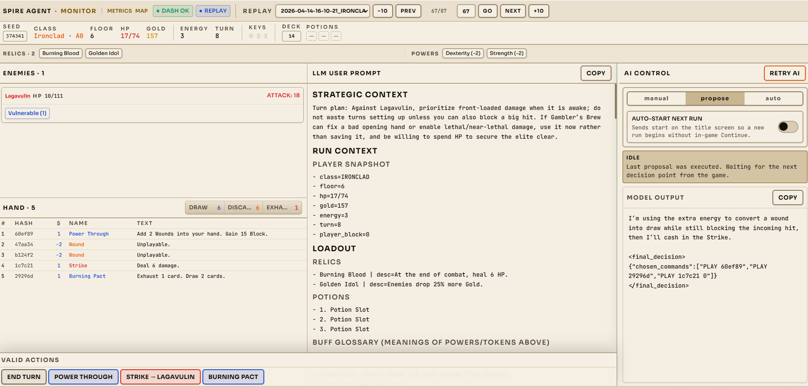
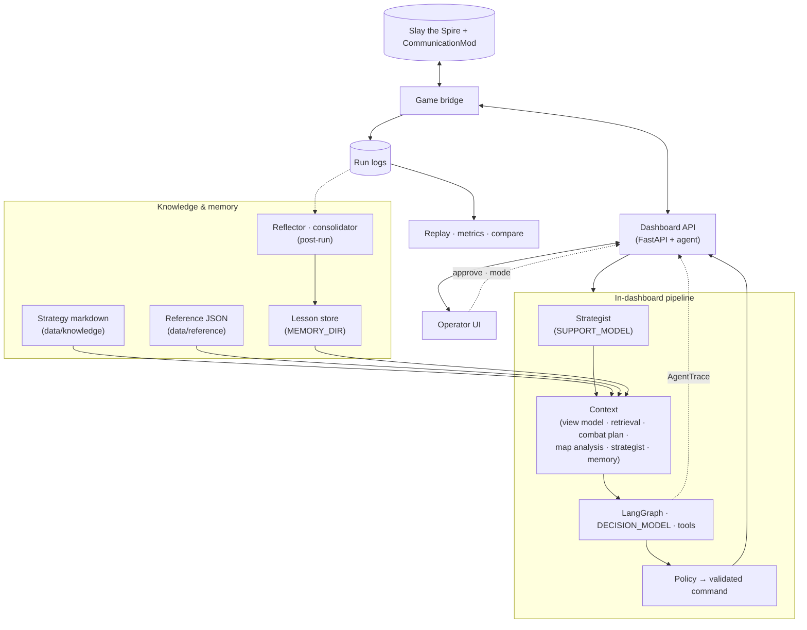

# Spire Agent

**Spire Agent** is an operator dashboard and LLM runtime for *Slay the Spire*. It pairs with [CommunicationMod](https://github.com/ForgottenArbiter/CommunicationMod): game state flows in as JSON, the agent proposes actions, and you can steer everything from the browser—watch a run like a flight deck, approve risky lines, or let it play hands-free while you study traces and metrics.

## What you get

- **Live monitor** — Relics, powers, orbs, hand, enemies, and the full grid of legal actions the mod exposes, kept in sync over HTTP and WebSocket.
- **Model visibility** — The same context the decision model sees (including strategist notes and combat framing), plus reasoning when the API returns it, final JSON commands, and a timestamped session log.
- **Human in the loop** — `manual`, `propose` (approve each line), or `auto` from the UI; retry and mode switches without restarting the game.
- **Grounded strategy** — Markdown guides under `data/knowledge/`, factual tables in `data/reference/`, optional map analysis, and a **support** model that maintains high-level notes while a **decision** model picks plays. Post-run reflection can write lessons into `MEMORY_DIR` and consolidate them over time.
- **Run analytics** — Per-run metrics, multi-run compare, and map replay over folders under `logs/` (see [`apps/web/README.md`](apps/web/README.md) for routes).

## Dashboard



## Requirements

- **Python 3.11+** ([`pyproject.toml`](pyproject.toml))
- **[uv](https://docs.astral.sh/uv/)** for installs and `uv run …`
- **Node.js** for the web UI (npm workspaces at repo root)
- **Slay the Spire** with CommunicationMod configured to launch this repo’s bridge (see [CommunicationMod `command`](#communicationmod-command))

## Install

```bash
uv sync
npm install
```

Copy [`.env.example`](.env.example) to **`.env`** and set at least **`API_KEY`** and your OpenAI-compatible **`API_BASE_URL`** if needed. Full variable list and defaults live in `.env.example` and [`src/agent/config.py`](src/agent/config.py): **`DECISION_MODEL`** / **`DECISION_REASONING_EFFORT`** (gameplay, combat plans, reflection), **`SUPPORT_MODEL`** / **`SUPPORT_REASONING_EFFORT`** (strategist, history compaction), **`AGENT_MODE`**, **`KNOWLEDGE_DIR`**, **`MEMORY_DIR`**, timeouts, and consolidation cadence. Without **`API_KEY`**, AI stays off and you can still drive the game manually through the dashboard.

## Run the stack

Start **terminal A** first so the bridge can reach the API.

**A — Dashboard (FastAPI, `127.0.0.1:8000`):**

```bash
run_api.bat
```

or `./run_api.sh` (runs `uv run uvicorn src.ui.dashboard:app --host 127.0.0.1 --port 8000 --reload`).

**B — Operator UI (optional, Vite):**

```bash
npm run dev:web
```

Open **`http://127.0.0.1:5173/`** for the monitor; **`/metrics`**, **`/metrics/compare`**, and **`/metrics/map`** for analytics. The API alone is at **`http://127.0.0.1:8000/`**. Production static build: `npm run build:web` → `apps/web/dist/`.

**C — Game bridge:**

```bash
uv run python -m src.main
```

(or `run_agent.bat` / `./run_agent.sh`). The process prints `ready`, reads **JSON lines** from stdin, **`POST`s** state to **`http://localhost:8000/update_state`**, and **`GET`s** **`/poll_instruction`** for the next command.

### Agent modes

`AGENT_MODE` and the dashboard support **`propose`** (human approves), **`auto`**, and **`manual`**. Details: `.env.example` and [`config.py`](src/agent/config.py).

## How it works

The dashboard process owns the agent loop. On each decision, **context** merges the processed game view, retrieval from **`data/knowledge`** and **`data/reference`**, strategist output (support model), combat planning, map analysis when applicable, and the lesson store. A **LangGraph** step runs the decision model with tools; validated commands go back to the bridge. Traces stream to the UI; run folders on disk feed metrics and reflection.



Module-level detail: [`architecture.md`](architecture.md) (with [data-flow-diagram.md](data-flow-diagram.md) and [user-sequence-diagram.md](user-sequence-diagram.md)).

## CommunicationMod `command`

Point the mod at this repo’s Python and bridge entrypoint (adjust paths):

**Windows:**

```properties
command=c:\\PATH\\to\\slay_the_spire_agent\\.venv\\Scripts\\python.exe c:\\PATH\\to\\slay_the_spire_agent\\src\\main.py
```

**macOS / Linux:**

```properties
command=/PATH/TO/slay_the_spire_agent/.venv/bin/python /PATH/TO/slay_the_spire_agent/src/main.py
```

## Limitations

### Watcher stance not in JSON (stock CommunicationMod)

This repo does **not** patch CommunicationMod. Stock [CommunicationMod](https://github.com/ForgottenArbiter/CommunicationMod) **does not serialize the Watcher’s stance** on `combat_state.player`—only fields like HP, block, energy, powers, and orbs. Stance lives on `AbstractPlayer.stance` and is omitted from JSON, so the agent cannot rely on stance from the wire format unless the mod is forked to export it (e.g. `stance_id`).

Source: [CommunicationMod `GameStateConverter.java` — `convertPlayerToJson`](https://github.com/ForgottenArbiter/CommunicationMod/blob/master/src/main/java/communicationmod/GameStateConverter.java#L715-L741).
