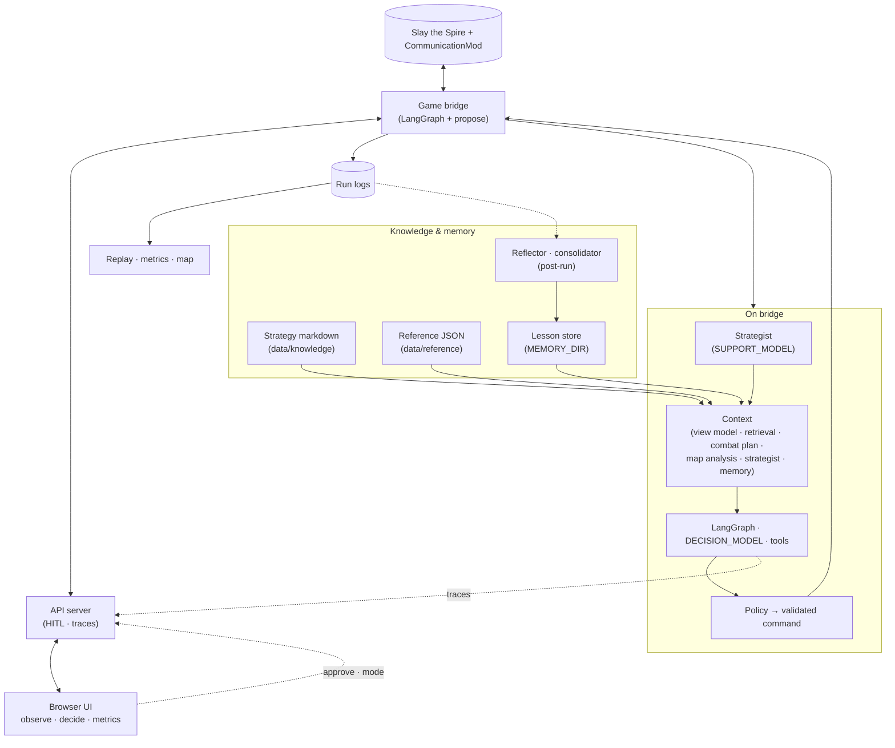

# Spire Agent

**Spire Agent** is an **autonomous LLM agent** for *Slay the Spire* (via [CommunicationMod](https://github.com/ForgottenArbiter/CommunicationMod)) with **human-in-the-loop** control: you can **observe** full traces and context, **shape decisions** (approve, edit, reject, retry), or **hand off** to fully automatic play. The stack is built to study **long-horizon** play—runs span many floors and acts, so planning, retrieval, and post-run memory matter as much as the next button press.

## What you get

- **Autonomous loop** — LangGraph agent with tools, policy-validated commands, and modes from full autonomy (`auto`) to gated proposals (`propose`) to human-only (`manual`).
- **`/` (Monitor)** — Live game state plus **observability**: prompts, strategist layer, combat framing, reasoning when available, proposals, and a session log—so you can audit *why* a long-run choice was made.
- **Human decisions** — Same surface for **intervention**: approve or change a line, retry after failure, switch mode without restarting the game.
- **Planning horizon** — Curated **`data/knowledge/`**, factual **`data/reference/`**, **map path analysis**, a **strategist** (support model) for scene-level notes, **combat planning**, **retrieval + `MEMORY_DIR`**, and **reflection** after runs so lessons accumulate across the spire.
- **`/metrics` · `/metrics/map`** — Per-run analytics and map replay to review **multi-act** trajectories, not just single combats.

## Monitor


## Requirements

- **Python 3.11+** ([`pyproject.toml`](pyproject.toml))
- **[uv](https://docs.astral.sh/uv/)**
- **Node.js** (repo root npm workspaces)
- **Slay the Spire** + CommunicationMod (configure in [Run the stack](#run-the-stack))

## Install

```bash
uv sync
npm install
```

Copy [`.env.example`](.env.example) to **`.env`**. OpenAI-compatible **`API_BASE_URL`**; **Responses API** is the best-tested path. Empty **`API_KEY`** → manual-only. Rest is in `.env.example`.

## Run the stack

Start the **API server** and **web UI** yourself. When you play with CommunicationMod, the mod **starts the bridge**—no extra terminal for that—using the **`command`** you set in the mod’s config (below).

**A — API server (`http://localhost:8000`):** `run_api.bat` or `./run_api.sh`  
Bridge and UI use this (REST + WebSocket). **`/`** here is only a short info page, not the Monitor.

**B — Web UI (dev):** `npm run dev:web` → **`http://localhost:5173`** — **/** Monitor, **/metrics**, **/metrics/map**. Proxies to port **8000**.  
Build: `npm run build:web` → `apps/web/dist/`.

### CommunicationMod

Set the mod’s **`command`** to an **absolute path** to this repo’s launcher (after `uv sync`, it `cd`s here and runs **`.venv`** + **`-m src.main`** — see [`run_agent.bat`](run_agent.bat) / [`run_agent.sh`](run_agent.sh)):

**Windows:** `command=ABSOLUTE_PATH\run_agent.bat`  
**macOS / Linux:** `command=ABSOLUTE_PATH/run_agent.sh`

On Unix: `chmod +x run_agent.sh`. Alternative: **`command`** = `.venv` Python + `src/main.py`.

**Bridge (spawned by the game):** prints **`ready`** when up. Debug the bridge alone: `uv run python -m src.main`.

### Agent modes

`propose` · `auto` · `manual` — see `.env.example`.

## How it works

The **bridge** ([`src/main.py`](src/main.py)) runs **`SpireDecisionAgent`**: a LangGraph loop that, each step, fuses the live view with **retrieval** (`data/knowledge`, `data/reference`), **strategist** output and **combat planning** for longer-horizon context, **map analysis** when you are on the map, and **memory** from past scenes and runs. The **decision** model chooses actions (with tools); outputs are **validated** before execution. The **API server** carries **HITL** state—approvals, edits, mode—so humans stay in the loop for **observability and decisions** while the agent can otherwise run on its own. The bridge sends the final command to the game. **`logs/`** feeds **Metrics** and **map** for reviewing whole runs.



More detail: [`ARCHITECTURE.md`](ARCHITECTURE.md), [data-flow-diagram.md](data-flow-diagram.md), [user-sequence-diagram.md](user-sequence-diagram.md).

## Limitations

### Watcher stance not in JSON (stock CommunicationMod)

Unmodified [CommunicationMod](https://github.com/ForgottenArbiter/CommunicationMod) does **not** put the Watcher’s stance on `combat_state.player` in JSON (HP, block, energy, powers, orbs only). The agent cannot rely on stance from the wire unless the mod is extended (e.g. `stance_id`).

Source: [CommunicationMod `GameStateConverter.java` — `convertPlayerToJson`](https://github.com/ForgottenArbiter/CommunicationMod/blob/master/src/main/java/communicationmod/GameStateConverter.java#L715-L741).
