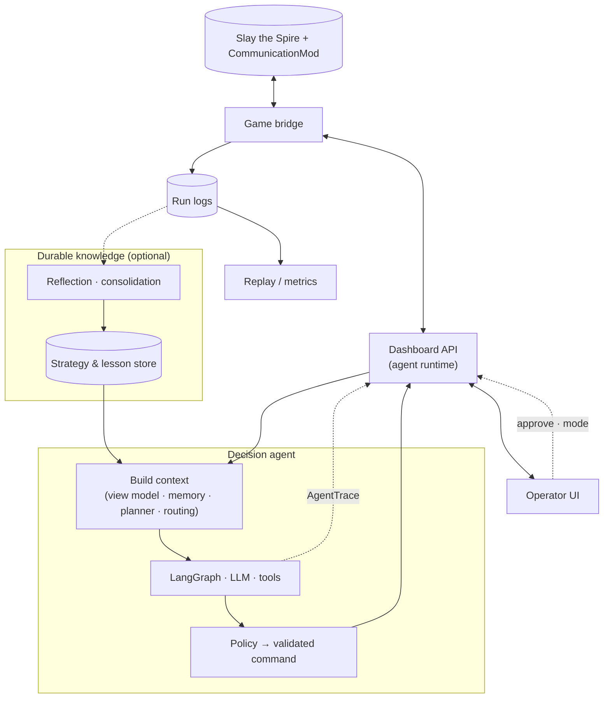

# Slay the Spire LLM Bot

This repo is a **full-stack LLM agent** wired into **Slay the Spire** via [CommunicationMod](https://github.com/ForgottenArbiter/CommunicationMod). It is also a practical **AI engineering** codebase: a long-horizon, tool-using decision loop with human-in-the-loop controls, structured traces, and offline analysis over logged runs.

**Runtime stack:**

- **`src/main.py`** — stdin/stdout bridge to the game; forwards state to the dashboard; polls for manual or AI-approved commands.
- **`src/agent/`** — LangGraph decision graph ([`graph.py`](src/agent/graph.py)), OpenAI-compatible client ([`llm_client.py`](src/agent/llm_client.py)), prompts, tool registry, policy/validation, optional planning and memory.
- **`src/ui/dashboard.py`** — FastAPI control plane (HTTP + WebSocket) on port **8000**; exposes AI approve/reject, mode switches, and agent status for operators.
- **`apps/web/`** — Vite + React operator UI (live monitor, run metrics, map replay).

## AI engineering in this repo

Overview of how pieces connect: the **dashboard** hosts the agent loop; **durable knowledge** (docs, lesson store, optional reflection) feeds **context** before the **LangGraph** step; **structured traces** stream back through the same API the **operator UI** uses for HITL. The bridge records **logs** for replay and for offline reflection. For a deeper breakdown (modules, routes, trace fields), see [`ARCHITECTURE.md`](ARCHITECTURE.md).



> [!NOTE]
> Reference card/relic data is derived from the [Slay the Spire Reference Spreadsheet](https://docs.google.com/spreadsheets/d/1ZsxNXebbELpcCi8N7FVOTNGdX_K9-BRC_LMgx4TORo4) and game ingress via CommunicationMod. This project is not affiliated with ForgottenArbiter.

## Repository layout

| Path | Role |
|------|------|
| [`src/`](src/) | Python package: bridge, agent, [`state_processor`](src/ui/state_processor.py) (game JSON → view model), dashboard. |
| [`apps/web/`](apps/web/) | React monitor (`@slay/web`); dev server proxies `/api` and `/ws` to **127.0.0.1:8000**. |
| [`data/`](data/) | Processed reference JSON under `data/processed/`, optional strategy text under `data/strategy/`. |
| [`logs/`](logs/) | Per-run folders of JSON snapshots written by the bridge (older runs may be zipped; see `MAX_LOG_RUNS` in [`src/main.py`](src/main.py)). |
| [`scripts/`](scripts/) | [`extract_reference_data.py`](scripts/extract_reference_data.py) — spreadsheet → `data/processed/*.json`. |

Architecture diagram and data flow: [`ARCHITECTURE.md`](ARCHITECTURE.md).

## Limitations

### Watcher stance not in JSON (stock CommunicationMod)

This project does **not** patch CommunicationMod. **Stock [CommunicationMod](https://github.com/ForgottenArbiter/CommunicationMod) never exports the Watcher’s current stance** in `combat_state.player`.

Upstream `GameStateConverter.convertPlayerToJson` only puts `max_hp`, `current_hp`, `block`, `powers`, `energy`, and `orbs` on the player object. It iterates **`AbstractCreature.powers`** for `powers` and does **not** read **`AbstractPlayer.stance`**, where the game stores Calm / Wrath / Divinity. Stance therefore does not appear as a dedicated field and is often **not** present in `powers` either (e.g. you can be in Wrath while `powers` is an empty list). The agent and dashboard **cannot** infer stance reliably from the wire format without forking the mod to serialize `stance` (e.g. `stance_id` from `player.stance.ID`).

Source (method body and comment listing exported fields): [CommunicationMod `GameStateConverter.java` — `convertPlayerToJson`](https://github.com/ForgottenArbiter/CommunicationMod/blob/master/src/main/java/communicationmod/GameStateConverter.java#L715-L741).

## Requirements

- **Python 3.11+** ([`pyproject.toml`](pyproject.toml))
- **[uv](https://docs.astral.sh/uv/)** — dependency install and `uv run` for Python entrypoints
- **Node.js** — for the web UI (`npm` at repo root uses workspaces)

## Install

Python deps are in **[`pyproject.toml`](pyproject.toml)** with **[`uv.lock`](uv.lock)** (no `requirements.txt`).

```bash
uv sync
npm install
```

Optional: copy [`.env.example`](.env.example) to **`.env`** at the repo root. Configuration is documented inline there and implemented in [`src/agent/config.py`](src/agent/config.py) (`LLM_API_KEY`, `AGENT_MODE`, models, timeouts, optional combat planner, etc.). Without `LLM_API_KEY`, the agent runs with AI disabled.

## Run the stack

Start **Terminal A** first so the bridge can reach the dashboard.

**Terminal A — dashboard API (127.0.0.1:8000):**

```bash
run_api.bat
```

or `./run_api.sh` — runs `uv run uvicorn src.ui.dashboard:app --host 127.0.0.1 --port 8000 --reload`

**Terminal B — React operator UI (optional):**

```bash
npm run dev:web
```

- **`http://127.0.0.1:5173/`** — main monitor (`/`), run metrics (`/metrics`), map replay (`/metrics/map`). See [`apps/web/README.md`](apps/web/README.md).
- **`http://127.0.0.1:8000/`** — minimal FastAPI landing page; the SPA is normally served by Vite in dev.

Production build for static assets: `npm run build:web` → `apps/web/dist/`.

**Terminal C — game bridge:**

```bash
uv run python -m src.main
```

or `run_agent.bat` / `./run_agent.sh`. Prints `ready`, reads **JSON lines** from stdin, **`POST`s** state to **`http://localhost:8000/update_state`**, and **`GET`s** **`/poll_instruction`** for the next command (manual input or approved AI line).

### Agent modes

`AGENT_MODE` (and the dashboard) support roughly **`propose`** (human approves), **`auto`**, and **`manual`**. See `.env.example` and [`config.py`](src/agent/config.py). For how this fits into the agent graph and APIs, see [AI engineering in this repo](#ai-engineering-in-this-repo) above.

### API overview

Used by the web app and bridge:

| Area | Examples |
|------|----------|
| Bridge ↔ dashboard | `POST /update_state`, `GET /poll_instruction`, `POST /action_taken`, `POST /log`, `POST /agent_trace` |
| AI / HITL | `POST /api/ai/approve`, `POST /api/ai/reject`, `POST /api/ai/mode`, `GET /api/ai/state`, `GET /api/ai/retry_poll`, `POST /api/agent/retry`, `GET /api/agent/status` |
| Debug / monitor | `GET /api/debug/snapshot`, `POST /api/debug/ingress`, `POST /api/debug/manual_command`, `GET /api/debug/poll_instruction`, **`WebSocket /ws`** (`snapshot` payloads) |
| Run logs / metrics | `GET /api/runs`, `GET /api/runs/{run_name}/metrics`, `GET /api/runs/{run_name}/map_history`, `GET /api/runs/{run_name}/frames`, … |

**`/api/history/*`** is still stubbed (empty lists) where not backed by storage.

## CommunicationMod `command`

Use absolute paths to the repo and `.venv`:

**Windows:**

```properties
command=c:\\PATH\\to\\slay_the_spire_agent\\.venv\\Scripts\\python.exe c:\\PATH\\to\\slay_the_spire_agent\\src\\main.py
```

**macOS / Linux:**

```properties
command=/PATH/TO/slay_the_spire_agent/.venv/bin/python /PATH/TO/slay_the_spire_agent/src/main.py
```

## Scripts

[`scripts/extract_reference_data.py`](scripts/extract_reference_data.py) — reads **`data/raw/Slay the Spire Reference.xlsx`**, writes **`data/processed/*.json`** (requires **pandas** / **openpyxl**, declared in [`pyproject.toml`](pyproject.toml)).
