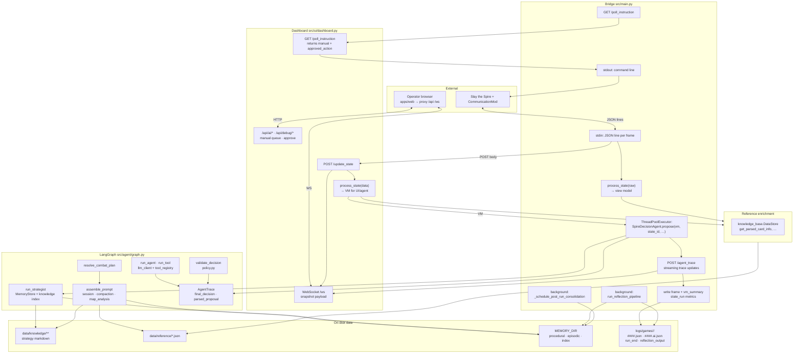

# Data flow diagram

End-to-end movement of game state, view models, agent context, traces, logs, and memory. Narrative and tables: [architecture.md](architecture.md).

```mermaid
flowchart TB
  subgraph External["External"]
    STS["Slay the Spire + CommunicationMod"]
    Browser["Operator browser\napps/web → proxy /api /ws"]
  end

  subgraph Disk["On-disk data"]
    Know["data/knowledge/**\nstrategy markdown"]
    Ref["data/reference/*.json"]
    Mem["MEMORY_DIR\nprocedural · episodic · index"]
    Logs["logs/games/<run>/\n####.json · ####.ai.json\nrun_end · reflection_output"]
  end

  subgraph Bridge["Bridge src/main.py"]
    In["stdin: JSON line per frame"]
    PS_B["process_state(raw)\n→ view model"]
    LogW["write frame + vm_summary\nstate_run metrics"]
    AIW["ThreadPoolExecutor:\nSpireDecisionAgent.propose(vm, state_id, …)"]
    TrPost["POST /agent_trace\nstreaming trace updates"]
    Poll["GET /poll_instruction"]
    Out["stdout: command line"]
    ReflT["background:\nrun_reflection_pipeline"]
    ConsT["background:\n_schedule_post_run_consolidation"]
  end

  subgraph Dash["Dashboard src/ui/dashboard.py"]
    Upd["POST /update_state"]
    PS_D["process_state(data)\n→ VM for UI/agent"]
    WS["WebSocket /ws\nsnapshot payload"]
    Apis["/api/ai/* · /api/debug/*\nmanual queue · approve"]
    PollH["GET /poll_instruction\nreturns manual + approved_action"]
  end

  subgraph KB["Reference enrichment"]
    DS["knowledge_base.DataStore\nget_parsed_card_info, …"]
  end

  subgraph LG["LangGraph src/agent/graph.py"]
    ST["run_strategist\nMemoryStore + knowledge index"]
    PL["resolve_combat_plan"]
    PB["assemble_prompt\nsession · compaction · map_analysis"]
    RA["run_agent · run_tool\nllm_client + tool_registry"]
    VA["validate_decision\npolicy.py"]
    Trace["AgentTrace\nfinal_decision · parsed_proposal"]
  end

  STS <-->|"JSON lines"| In
  In --> PS_B
  PS_B --> KB
  KB --> Ref
  In -->|"POST body"| Upd
  Upd --> PS_D
  PS_D --> KB

  Browser <-->|"HTTP"| Apis
  Browser <-->|"WS"| WS
  Upd --> WS
  TrPost --> WS

  PS_D -->|"VM"| AIW
  AIW --> ST
  ST --> Know
  ST --> Mem
  PL --> PB
  PB --> Know
  PB --> Mem
  PB --> Ref
  RA --> Trace
  VA --> Trace
  AIW --> TrPost
  AIW --> Trace

  LogW --> Logs
  TrPost --> LogW

  ReflT --> Logs
  ReflT --> Mem
  ConsT --> Mem

  Poll --> PollH
  PollH --> Out
  Out --> STS
```
