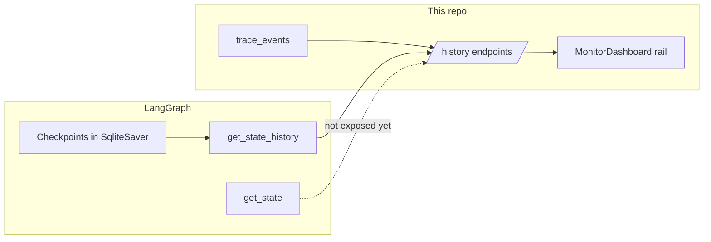

# Run threading, seed-based isolation, and History Explorer

This document is the **feature + architecture spec** for:

1. **Per-run LangGraph isolation** using CommunicationMod **seed** as the stable run key (plus a **menu sentinel**).
2. **History Explorer** and related APIs/UI (phased after the foundation).

It consolidates LangGraph persistence concepts, the current repo state, gaps, and an implementation checklist.

## Plan of record (replacement scope)

Near-term **history / debugger** delivery is driven by **this doc**: LangGraph checkpoints + existing `trace_events` + history HTTP APIs + Explorer UI. That is the intended **functional replacement** for migration **Stage 13–style** “SQLite telemetry + history explorer” work without building the full canonical schema in [`docs/restart/16-sqlite-telemetry-and-history-explorer-spec.md`](../restart/16-sqlite-telemetry-and-history-explorer-spec.md) first.

- [**Stage 11**](../restart/TODO.md) (strategic planner) and [**Stage 12**](../restart/TODO.md) (full operator UI + streaming) are **orthogonal**; they are not delivered here.
- [`docs/restart/14-debugger-frontend-redesign-spec.md`](../restart/14-debugger-frontend-redesign-spec.md) remains background product direction; Phase 2 here implements the **forensic** slice (timeline, JSON, checkpoints) toward that vision.

---

## Implementation checklist

- [ ] **Per-game thread:** Seed-derived + `run-menu` threads; route **resume** to the **pending interrupt** thread when latest ingress is menu.
- [ ] **Run boundary:** `extract_run_seed`; numeric seed → `run-{seed}`; menu / no-run → sentinel seed `menu`, `thread_id` `run-menu`.
- [ ] **Effective `thread_id` in status:** [`get_agent_status()`](../../src/control_api/agent_runtime.py) and WebSocket snapshots must expose the **actual graph `thread_id`** used for the last `invoke` / resume (including `pending_graph_thread_id` / interrupt thread when applicable). Thread id is always ingress-derived, not overridable via env.
- [ ] **Invariant:** For any open HITL interrupt, **`RunnableConfig` `thread_id`**, **trace_events `thread_id`**, and **operator-facing “active thread”** must all match the **interrupt’s** thread until the interrupt is cleared — not `run-menu` derived from the latest ingress.
- [ ] **UI seed:** Expose `run_seed` and effective `thread_id` on snapshot / agent status; show in **MonitorDashboard** (e.g. command bar).
- [ ] **Memory namespace:** Scope `InMemoryMemoryStore` by run / `thread_id` (or clear on new run); consider whether **episodic `memory_log`** in graph state should reset on run boundary (separate from store namespace).
- [ ] **Menu ingress policy:** Define whether **menu-only** ingress runs the **full graph** on `run-menu` or **short-circuits** (skip / minimal path) to avoid unbounded checkpoints on `run-menu`; must remain consistent with HITL routing above.
- [ ] **Router:** `apps/web` routes: `/` = monitor, `/explorer` = History Explorer with `?thread_id=`.
- [ ] **Explorer layout:** Three-pane explorer wired to `/api/history/*`; timeline + JSON inspector.
- [ ] **API:** Checkpoint detail (see **API extensions**): `get_state`-backed JSON with **allowlist**, **max response size**, and optional **debug-only** env gate for non-local hardening.
- [ ] **Optional:** Merge thread list from checkpoint tables when `trace_events` has no row for a thread; **dedupe** `thread_id` when the same id appears in both stores.
- [ ] **Tests / ops:** Integration tests (see **Tests**); document `SLAY_CHECKPOINTER=sqlite` and shared DB file in README or `ARCHITECTURE.md`.

---

## LangGraph capabilities (summary)

Official persistence model ([LangGraph persistence](https://docs.langchain.com/oss/python/langgraph/persistence)) centers on **threads** keyed by `configurable.thread_id`, **checkpoints** (one per **super-step**), and **StateSnapshot** objects.

| Capability | What it enables | Relevant API |
| ---------- | --------------- | ------------ |
| **Checkpointing** | Durable snapshots after each super-step; HITL / resume | Compile with a `checkpointer` (`InMemorySaver`, `SqliteSaver`, etc.) |
| **Latest state** | Inspect current thread state | `graph.get_state({"configurable": {"thread_id": ...}})` |
| **Point-in-time state** | Inspect a specific snapshot | Same config plus `checkpoint_id` (and `checkpoint_ns` when subgraphs exist) |
| **Timeline / ancestry** | Ordered list of snapshots for debugging | `graph.get_state_history(config, limit=...)` — docs: **newest first** |
| **Time travel / replay** | Re-run from a prior checkpoint | `invoke` with config pointing at a prior `checkpoint_id`; later steps re-execute (including side effects) |
| **Fork edits** | Branch state without mutating old checkpoints | `update_state` creates a new checkpoint |
| **Cross-thread memory** | Shared store (not thread state) | LangGraph `Store` — not required for per-thread debugger UX |

**SqliteSaver** persists LangGraph checkpoint tables in SQLite (synchronous; async code may use `AsyncSqliteSaver`). FastAPI must manage connection lifecycle (`check_same_thread`, `setup()`, shutdown `close`).

---

## Runtime thread resolution (HITL + menu)

Use a single internal notion of **effective graph `thread_id`** for each operation:

- **Idle / menu, no interrupt:** ingress-derived `run-menu` (or seed → `run-{seed}` when in run).
- **In run, no pending interrupt:** seed-derived `run-{seed}` for invoke and traces.
- **Pending HITL interrupt:** `thread_id` for **all** `Command(resume=...)`, trace writes, and status fields that describe “where the graph is waiting” must remain the **interrupt thread** (the run that entered `interrupt`), even if the **latest** CommunicationMod payload is menu-shaped and would map to `run-menu`.

Document implementer-facing states loosely as: **idle_menu** → **in_run** → **awaiting_hitl** (awaiting may coincide with menu ingress — routing must still prefer the interrupt thread until cleared).

---

## What this repo already stores and exposes

### 1. Checkpoints (LangGraph)

- Factory: [`src/control_api/checkpoint_factory.py`](../../src/control_api/checkpoint_factory.py) — `SLAY_CHECKPOINTER` = `memory` (default) or `sqlite`; path via `SLAY_SQLITE_PATH` or `logs/slay_agent.sqlite`.
- Runtime: [`src/control_api/agent_runtime.py`](../../src/control_api/agent_runtime.py).
- With `memory`, checkpoint history is **process-scoped**. **Durable** forensics need `sqlite`.

**Implemented:** [`get_agent_status()`](../../src/control_api/agent_runtime.py) exposes the effective graph `thread_id` from the last summary (ingress seed / interrupt pin).

### 2. Trace events (app-owned)

- [`src/trace_telemetry/sqlite_store.py`](../../src/trace_telemetry/sqlite_store.py): table **`trace_events`** (JSON payloads, indexed by `thread_id`, `state_id`, `step_seq`).
- Same SQLite file as checkpoints when `sqlite` is enabled: **one file, two subsystems**.
- [`record_agent_invocation`](../../src/trace_telemetry/recorder.py) keys off **`configurable.thread_id`** — it must stay aligned with the same `RunnableConfig` as `invoke` / `Command(resume=...)`.

### 3. Read-only history HTTP API

[`src/control_api/history.py`](../../src/control_api/history.py):

- `GET /api/history/threads` → summaries from trace store.
- `GET /api/history/events` → `trace_events` (optional `thread_id`, pagination).
- `GET /api/history/checkpoints?thread_id=` → `get_state_history`; `_snapshot_to_dict` **omits** full `StateSnapshot.values` (metadata + `state_id` only by design).

### 4. Web UI today

- [`apps/web/src/App.tsx`](../../apps/web/src/App.tsx): only `MonitorDashboard` (no router).
- [`useControlPlane.ts`](../../apps/web/src/hooks/useControlPlane.ts) + [`MonitorDashboard.tsx`](../../apps/web/src/components/MonitorDashboard.tsx): history rail (threads, events, checkpoints).

### 5. Product / spec alignment

- [`docs/restart/14-debugger-frontend-redesign-spec.md`](../restart/14-debugger-frontend-redesign-spec.md): deep debugger (trace explorer, timeline, JSON) **separate** from the main command center.
- [`docs/restart/16-sqlite-telemetry-and-history-explorer-spec.md`](../restart/16-sqlite-telemetry-and-history-explorer-spec.md): longer-term `runs` / `threads` / events schema (optional; Phase 1 does not require it).

---

## Gap analysis (LangGraph vs implemented)

- **Thread list:** Driven by `trace_events` only; checkpoint-only threads may be missing from `/api/history/threads` until merge logic exists.
- **Checkpoint body:** Need a dedicated **checkpoint detail** endpoint for JSON inspector UX.
- **Correlation:** Trace `state_id` vs checkpoint metadata may need tighter guarantees if the UI cross-links automatically.
- **Replay / `update_state`:** Treat as **explicit, gated** operations (side effects / LLM re-run).

---

## Per-game isolation (problem statement)

LangGraph **already isolates by `thread_id`** (see `test_thread_ids_isolate_state` in [`tests/test_decision_graph.py`](../../tests/test_decision_graph.py)). The control API today uses a **fixed** id.

### Current behavior (summary)

| Layer | Behavior |
| ----- | -------- |
| **Config** | ~~Fixed env thread~~ Replaced by per-ingress `run-{seed}` / `run-menu`. |
| **Checkpoints** | All runs share one checkpoint lineage for that id. |
| **trace_events** | `step_seq` is monotonic **per thread** → one long stream across games. |
| **Proposal hygiene** | [`_proposal_hygiene`](../../src/decision_engine/graph.py) can reset terminal proposals on `state_id` change; **does not** clear `memory_log` / `memory_seq_cursor`. |
| **memory_update_node** | Appends every ingress; prior-run lines can remain on the same thread. |
| **InMemoryMemoryStore** | `("strategy", cls)` only — no per-run scoping. |

### Recommended fix: one LangGraph `thread_id` per STS run

- **One `thread_id` = one run** (not one HTTP session). Use it for every `invoke` / `Command(resume=...)` until run identity changes.
- **Implement in** [`agent_runtime.py`](../../src/control_api/agent_runtime.py): process-held key → `configurable.thread_id`.
- **`get_agent_status()` / snapshots:** Expose **`thread_id`**, **`run_seed`**, and when needed **`pending_graph_thread_id`** (or equivalent) so operators never confuse menu ingress id with interrupt id.
- **Env thread override:** removed; identity is always seed / menu from the wire.

### CommunicationMod seed as stable run key

- **Resume later:** With `SLAY_CHECKPOINTER=sqlite`, deterministic `thread_id` from seed restores checkpoints + traces across API restarts (same DB file).
- **New run:** New seed → new `thread_id` → isolation.
- **Where seed is today:** Not read in Python. [`GameAdapterInput`](../../src/domain/contracts/ingress.py) keeps `game_state` as `dict[str, Any]`; CommunicationMod typically includes **`game_state["seed"]`** (often a long int). [`project_state`](../../src/domain/state_projection/project.py) does not use `seed` yet.
- **Helper:** `extract_run_seed(ingress) -> str` (single place; does not change `state_id` hashing unless explicitly requested).
- **In-run:** Canonical string (e.g. `str(int(seed))`) → `thread_id = f"run-{seed}"`. **Seed collisions:** ignored for now per product.
- **Validation:** Phase 1 should add **tests** with int seed, string numeric seed, missing seed, and `in_game: false`; optionally a **redacted** fixture of a real CommunicationMod payload.
- **Mid-run seed change:** Rare (e.g. odd mod behavior). **Document the chosen policy** (e.g. always treat changed seed as **new `thread_id`**) so behavior is predictable.
- **Menu / no active run:** Sentinel logical seed **`menu`** → **`thread_id = "run-menu"`**. Use when `in_game` is false **or** wire seed is missing/unusable. **All menu time shares one thread**; Explorer may filter `run-menu` later.

### Pending HITL while on menu

Latest ingress may map to **`run-menu`**, but an open interrupt belongs to **`run-{real_seed}`**. **Resume / approve / reject** must use the **interrupted thread’s** config. Phase 1 needs e.g. **`pending_graph_thread_id`**, or queue/reject menu ingress until resolved, etc. **Do not** resume against `run-menu` by mistake.

### Architecture assessment

- Aligns **game run identity** with LangGraph persistence.
- **`state_id`** ≠ seed: content hash per snapshot vs run-stable key — keep separate.
- **Menu sentinel** is explicit; **operational clarity** requires surfacing `run_seed` + **effective** `thread_id` on snapshot.

### Run boundary fallbacks (if seed missing in odd modes)

1. Explicit flags on ingress / adapter.
2. Heuristics (weaker): e.g. `in_game` transitions.
3. Dev: `POST /api/debug/new_run` (UUID `thread_id`) for tests.

### InMemoryMemoryStore

Namespace by run, e.g. `("strategy", cls, thread_id)`, or clear `last_turn` on run boundary.

### Explorer impact

`/api/history/threads` becomes effectively a **run picker** (one row per past `thread_id`).

---

## Recommended repo changes

### A0. Seed visibility (with Phase 1 threading)

- Add **`run_seed`** and **effective `thread_id`** to [`get_agent_status()`](../../src/control_api/agent_runtime.py) and WebSocket snapshot payload.
- **MonitorDashboard:** show both in the status strip (alongside mode, proposer, `state_id`).

### A. Routing and History Explorer page

1. **react-router-dom** (or similar): `/` = monitor, `/explorer` (or `/history`) = History Explorer.
2. **Layout:** thread (run) picker | unified timeline (events + checkpoints) | JSON inspector.
3. **Deep link:** `?thread_id=` from monitor.
4. Optionally slim the History rail once the page exists.

### B. API extensions

1. **Checkpoint detail:** Prefer extending the existing surface where natural, e.g. **`GET /api/history/checkpoints`** with optional `checkpoint_id` + `checkpoint_ns` to return **one** snapshot with serialized `values`, **or** a dedicated `GET /api/history/checkpoint` — same semantics: `graph.get_state` with `{ thread_id, checkpoint_id?, checkpoint_ns? }`.
2. **Safe serialization:** Payloads may include large or sensitive fields (`ingress_raw`, LLM blobs). Apply a **field allowlist** (and/or denylist), **max JSON bytes**, and consider guarding the route behind **`SLAY_DEBUG_HISTORY_STATE=1`** (or equivalent) outside local dev.
3. **Optional:** merge checkpoint-derived thread ids into `/api/history/threads` with **dedupe** when also present in `trace_events`.
4. **Later:** gated replay / fork endpoints.

### C. Frontend types and hooks

- Extend [`viewModel.ts`](../../apps/web/src/types/viewModel.ts) for checkpoint detail + timeline DTOs.
- Split **`useHistoryExplorer`** from **`useControlPlane`**.

### D. Tests

- Checkpoint detail route tests (pattern: [`tests/test_sqlite_persistence.py`](../../tests/test_sqlite_persistence.py)).
- **SQLite:** Restart API process, same DB path, same seed → still able to **resume** an open HITL interrupt.
- **HITL + menu:** With interrupt open, simulate menu-shaped ingress → **resume** must use **game** `thread_id`, not `run-menu`.
- **Isolation:** New seed → new checkpoint lineage; `step_seq` in traces does not **continue** a prior run’s series under the new `thread_id`.

### E. Documentation / ops

- Document `SLAY_CHECKPOINTER=sqlite`, shared DB file, and LangGraph super-step / history ordering.

---

## Phased readiness

**Phase 1 (foundation):** Ship **together** in one coherent change set: `extract_run_seed`, menu sentinel, seed-derived `thread_id`, **HITL vs menu routing**, **effective `thread_id` / `run_seed` on status + WS**, MonitorDashboard, memory namespace by `thread_id`, **menu ingress policy** (avoid `run-menu` checkpoint blow-up). *Do not* ship seed visibility alone without routing — the UI would mislead operators.

**Phase 2 (debugger redesign):** Router, History Explorer page, checkpoint detail API (with serialization limits), optional SQLite thread merge.

Phase 1 should **not** wait on the full doc-16 schema.

---

## Out of scope (unless requested)

- LangGraph Agent Server / hosted threads as deployment target.
- Full 16-table telemetry schema as a prerequisite for Phase 1.
- Automatic replay from UI without explicit safeguards.

---

## References

- [LangGraph persistence](https://docs.langchain.com/oss/python/langgraph/persistence)
- [`docs/restart/10-langgraph-persistence-and-hitl-ops.md`](../restart/10-langgraph-persistence-and-hitl-ops.md)
- [`docs/restart/14-debugger-frontend-redesign-spec.md`](../restart/14-debugger-frontend-redesign-spec.md)
- [`docs/restart/16-sqlite-telemetry-and-history-explorer-spec.md`](../restart/16-sqlite-telemetry-and-history-explorer-spec.md)
