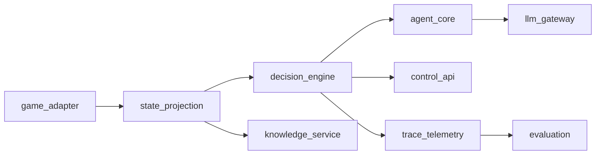

# Target Architecture

## Purpose
Define the clean-slate architecture and dependency boundaries before implementation.

**Rewrite stance:** Module names in this document (`game_adapter`, `state_projection`, …) describe **responsibilities**, not immutable identifiers. The team may rename packages, files, and public types for clarity; update architecture docs when they do.

## Proposed Modules
- `game_adapter`: protocol boundary for CommunicationMod I/O.
- `state_projection`: pure transform from raw state to typed decision state and UI state.
- `decision_engine`: orchestration of modes, proposal lifecycle, sequence queue, retries.
- `agent_core`: model-agnostic policy, output parser, validation, command resolution, strategic+tactical role schemas.
- `llm_gateway`: provider adapters, retry/timeout policy, model routing.
- `knowledge_service`: indexed read-only game knowledge lookups.
- `control_api`: REST/WS human-in-the-loop API.
- `trace_telemetry`: structured events, persistence, correlation ids.
- `evaluation`: replay and parity analytics.

## LangChain and LangGraph Alignment (Context7)
- LangChain v1 APIs should be the default integration target.
- Use explicit structured-output strategy per task:
  - `ProviderStrategy` when provider-native structured output is robust.
  - `ToolStrategy` as cross-provider fallback.
- Use LangGraph for orchestration primitives:
  - typed state schemas,
  - checkpointed durable execution,
  - interrupt/resume for human approval gates,
  - subgraphs for reusable workflows.

## Dependency Rules
1. Inner modules cannot import outer modules.
2. `agent_core` cannot import web framework or filesystem.
3. `state_projection` must be side-effect free.
4. `decision_engine` owns state transitions; UI cannot mutate decision state directly.
5. `llm_gateway` is the only module allowed to call provider SDKs.

## Runtime State Model (Rewrite)
- `DecisionState`: current mode, current turn key, proposal state, failure streak, queued commands.
- `ProposalState`: request id, state id, status, timestamps, result/error.
- `ExecutionState`: last executed command, origin, outcome.
- `StrategicPlanState`: active plan id, trigger reason, horizon, expiry, last tactical alignment.

## Framework Mapping
- `decision_engine` -> LangGraph `StateGraph` runtime.
- `control_api` approval/rejection -> LangGraph `interrupt(...)` and `Command(resume=...)`.
- `trace_telemetry` and replay -> graph checkpoints + event logs.
- `agent_core` output typing -> LangChain structured response models.

## Replay and Evaluation Modes
- `deterministic` mode (merge-blocking):
  - use recorded/mocked `llm_gateway` responses and fixed fixtures,
  - enforce strict parity assertions for decision legality and lifecycle transitions.
- `stochastic` mode (non-blocking trend gate):
  - use live provider calls with bounded variance expectations,
  - track drift metrics and alert on sustained degradation.
- CI merge policy must use deterministic mode for required checks.

## Checkpoint/Event Write Strategy
- For critical transitions, use checkpoint-first then canonical event append with idempotency key.
- Maintain an outbox/reconciliation path for event append failures after checkpoint success.
- Any replay tool must support deduplication by (`thread_id`, `checkpoint_id`, `event_type`).

## Persistence Model (LangGraph)
- For graphs compiled with a checkpointer, every invocation must include `config={"configurable": {"thread_id": ...}}`; without it, checkpoints cannot be associated to a thread for resume/history.
- Checkpoints are treated as first-class runtime artifacts at super-step boundaries.
- Replay/time-travel is supported by invoking with prior `checkpoint_id`.
- `update_state` is allowed only for controlled operator/debug workflows and must emit audit events.
- Subgraph checkpoint namespaces (`checkpoint_ns`) must be preserved in telemetry for drill-down debugging.
- Pending writes behavior is part of fault-tolerance expectations; successful sibling-node writes must not be re-executed on resume.

## Checkpointer and Store Choices
- Dev/test: `InMemorySaver` and `InMemoryStore` only.
- Local durable testing: `SqliteSaver` (`AsyncSqliteSaver` for async flows).
- Production: `PostgresSaver` (`AsyncPostgresSaver`) and persistent store backend.
- If deploying via LangSmith Agent Server/API, rely on managed checkpoint/store infrastructure where available.
- Persisted checkpoint payloads should use encrypted serializer in sensitive environments.

## Local Canonical Telemetry Storage
- Use SQLite as the canonical local telemetry/event store for debugger and replay query paths.
- Canonical schema includes events, stream events, decisions, interrupts, checkpoints, and recovery outbox.
- JSON sidecar logs are retained as migration/export artifacts, not canonical source of truth.

## Implementation Notes
- Start with domain package and interfaces.
- Add adapters after domain APIs compile.
- Keep the **game protocol** unchanged via `game_adapter` (typed ingress/egress); this is not a commitment to legacy **Python module** names or internal APIs.

## Context7 References (Validated)
- LangGraph persistence (`thread_id`, checkpoints, `get_state` with `checkpoint_id`): https://docs.langchain.com/oss/python/langgraph/persistence
- LangGraph add memory (`InMemorySaver` compilation/invocation patterns): https://docs.langchain.com/oss/python/langgraph/add-memory
- LangGraph interrupts and resume (`interrupt(...)`, `Command(resume=...)`, multi-interrupt resume map): https://docs.langchain.com/oss/python/langgraph/interrupts
- LangChain structured output (`ProviderStrategy`/`ToolStrategy` behavior): https://docs.langchain.com/oss/python/langchain/structured-output
