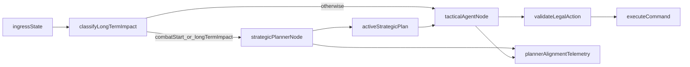

# Strategic Planner Collaboration

## Purpose
Define a two-agent collaboration pattern where a strategic planner provides advisory guidance to the tactical decision agent during the restart.

## Decisions Locked
- Planner authority: **advisory only**.
- Planner trigger policy: run at:
  - start of each combat,
  - decisions classified as long-term impact.

## Why This Fits the Restart
- Aligns with `decision_engine` orchestration ownership.
- Preserves `agent_core` command legality validation as the safety boundary.
- Uses LangGraph checkpoint/store model for replayable strategic context.

This should be implemented in the restart path, not by extending legacy global-state queues.

## Collaboration Model
The strategic planner does not emit executable commands. It emits short-horizon guidance that the tactical agent may follow or intentionally diverge from with a reason.

## Strategic Plan Contract (Advisory)
`StrategicPlan` should be typed and versioned with fields:
- `plan_id`
- `state_id`
- `turn_key`
- `created_at`
- `expires_at` (or deterministic invalidation rules)
- `horizon` (default: `next_3_decisions`)
- `primary_intent`
- `recommended_lines` (ordered list)
- `avoid_list` (high-risk lines to avoid)
- `risk_flags`
- `assumptions`
- `confidence`

## Trigger Classifier Rules
Planner runs on:
1. **Combat start**:
   - first actionable combat state in a combat segment.
2. **Long-term impact decision candidates**:
   - relic picks,
   - permanent deck changes (card add/remove/transform/upgrade),
   - route/pathing decisions,
   - potion retention/use decisions with future-floor impact,
   - event branches with persistent consequences.

Classifier output should be deterministic and recorded in telemetry.

## Tactical Consumption Rules
- Tactical agent receives latest active `StrategicPlan` as context.
- Tactical output remains command-first and legal-action constrained.
- Tactical result must include one alignment status:
  - `followed`
  - `partially_followed`
  - `diverged`
- If `diverged`, include a required `divergence_reason_code`.

## Safety and Degradation
- Strategic planner cannot bypass legal-action validation.
- If planner call fails/timeouts, degrade to tactical-only mode for that turn.
- Strategic plan invalidates on stale state boundaries:
  - `state_id` incompatibility for strict contexts,
  - `turn_key` change when plan assumptions are no longer valid.
- Never block command execution on planner availability.

## Observability Requirements
Add event types:
- `strategic_plan_started`
- `strategic_plan_completed`
- `strategic_plan_failed`
- `tactical_plan_alignment_recorded`

Required payload fields:
- `plan_id`, `horizon`, `trigger_reason`, `alignment_status`, `divergence_reason_code` (if any).

## Testing and Quality Gates
Minimum coverage for this capability:
- Trigger correctness tests (combat start and long-term-impact classifier).
- Planner failure degradation test (tactical-only fallback).
- Plan invalidation tests (`state_id` and `turn_key` stale cases).
- Alignment telemetry contract tests.
- Replay parity checks that verify command legality is unchanged by planner enablement.

## Implementation Sequence
1. Add typed contracts and schema fixtures.
2. Add trigger classifier and planner node in restart `decision_engine`.
3. Add tactical alignment fields and telemetry events.
4. Add quality-gate fixtures and replay checks.
5. Gate rollout behind feature flag until parity is stable.

## Non-Goals (Initial Slice)
- No hard policy enforcement from planner.
- No autonomous planner-only command execution.
- No mandatory planner refresh every turn.
