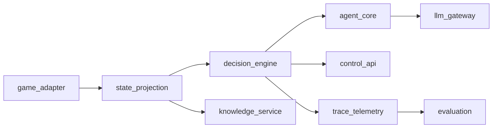

# Restart Architecture

## Purpose
This document defines the target architecture for the clean restart and acts as the implementation reference for the `docs/restart` plan set.

## Program stance: greenfield rewrite
The team is **replacing the existing implementation with a new codebase**, not carrying the old one forward behind a permanent dual-runtime. We accept the cost: schedule risk, re-validation effort, and breaking internal APIs. What must stay stable is **external game I/O (CommunicationMod)** and **operator-visible safety semantics** (command legality, stale handling, HITL), validated by contracts and replay—not by preserving old module names or file layout.

**Naming and layout:** Module names (`game_adapter`, `state_projection`, etc.), package paths under `src/`, HTTP routes, and UI structure are **defaults in this document set**. They may be renamed or reorganized whenever a clearer convention emerges. When names change, update the affected files under `docs/restart` (starting with this document and the [hub index](README.md)) and log the decision in the risk register or an ADR.

**Delivery style:** Work still lands in **vertical slices** with merge-blocking tests, but slices are milestones **inside the new tree**, not a strangler alongside a long-lived legacy path.

## Goals
- Preserve parity-critical behavior (protocol, safety, operator workflows) with explicit contracts—not parity of legacy code shape.
- Remove cross-layer coupling and stringly-typed behavior.
- Keep side effects isolated at system boundaries.
- Enforce quality gates from the first shipped slice of the new codebase.

## Architectural Principles
- Domain-first design: business logic is independent of frameworks and providers.
- Typed boundaries: all cross-module interfaces use explicit schemas.
- Deterministic core: projection, resolution, and validation are pure where possible.
- Observable runtime: structured telemetry with trace correlation.
- Iterative delivery: ship vertical slices in the new codebase with replay and contract tests; legacy code is reference for behavior, not a routing fallback forever.

## LangChain and LangGraph Decisions
- Orchestration runtime: LangGraph (`StateGraph`) for durable, stateful execution.
- Agent construction: LangChain v1 patterns with explicit structured output.
- Human-in-the-loop: LangGraph interrupts + resume commands as the approval primitive.
- Memory model:
  - short-term conversational state in graph state/checkpoint,
  - long-term memory through store-backed runtime tools.
- Debug and recovery: use checkpoint history for replay/time-travel style debugging.

### Framework mapping (concise)
- `decision_engine` → LangGraph `StateGraph` runtime.
- `control_api` approve/reject/edit → LangGraph `interrupt(...)` and `Command(resume=...)`.
- `trace_telemetry` and replay analytics → graph checkpoints plus canonical event logs.
- `agent_core` output typing → LangChain structured response models (`ProviderStrategy` / `ToolStrategy` as in the Context7 links below).

Normative detail on persistence, `thread_id`, checkpointer/store choices, `update_state`, and HITL runtime rules lives in `10-langgraph-persistence-and-hitl-ops.md`. Canonical SQLite telemetry schema is in `16-sqlite-telemetry-and-history-explorer-spec.md`.

## Logical Modules

### `game_adapter`
- Owns CommunicationMod protocol ingestion/emission.
- Converts external payloads to typed ingress DTOs.
- Is the only layer that writes commands back to the game.

### `state_projection`
- Transforms ingress state into typed read models:
  - decision-facing model
  - UI-facing view model
- Computes legal actions deterministically.
- Performs no network, storage, or provider calls.

### `decision_engine`
- Orchestrates runtime mode (`manual`, `propose`, `auto`).
- Manages proposal lifecycle: in-flight, stale, timeout, recovered.
- Owns queued command sequence state and execution policy.
- Compiles and runs the LangGraph with checkpointing enabled.

### `agent_core`
- Builds decision context.
- Parses model output to typed decision schema.
- Resolves decisions to legal commands with explainable fallback order.
- Enforces structured output schema at agent boundary.
- Supports role-specific schemas/prompts for:
  - strategic planning guidance (advisory),
  - tactical command proposal (executable candidate).

### `llm_gateway`
- Encapsulates all model provider interactions.
- Handles retries, timeouts, model routing, and usage metadata.
- Returns provider-agnostic typed response objects.
- Selects between LangChain `ProviderStrategy` and `ToolStrategy` based on model/provider capability.

### `knowledge_service`
- Provides indexed lookups for cards/relics/monsters/events/powers/potions.
- Exposes stable typed lookup APIs with explicit miss behavior.

### `control_api`
- Exposes operator and UI endpoints (state, trace, approve/reject, mode changes).
- Publishes websocket events for live updates.
- Uses versioned DTOs for all request/response payloads.
- Translates approval/reject/edit requests into graph resume commands.
- Serves the **operator UI** as a static bundle built from the **`apps/web`** package (Vite + React + TypeScript + Tailwind) in production; local development may use the Vite dev server with API proxying to `control_api`.

### Repository layout (monorepo)
- **`apps/web`**: browser UI only—routing, layout, components, and client state; no game or LLM logic.
- **Python packages** (see Suggested Package Layout below): live under `src/` (or a renamed tree); they implement `control_api`, domain logic, and adapters.
- Root **Node** workspace config (for example `package.json` workspaces) owns `apps/web` dependencies and scripts; Python dependencies remain managed separately (`uv` / `requirements.txt`).
- **Concrete commands** (dev proxy, production static mount): [`MONOREPO.md`](MONOREPO.md).

### `trace_telemetry`
- Emits runtime events, statuses, and diagnostics.
- Persists structured sidecar records for replay analysis.
- Maintains schema version compatibility guarantees.

### `evaluation`
- Runs offline replay and parity analytics.
- Produces run-level metrics and regression reports.

## Dependency Direction
Inner domain modules must not import outer adapters/frameworks.

### Import Direction vs Runtime Flow
The diagram below describes runtime call/data flow, not Python import direction.

Import direction requirements are strict:
- `domain/*` imports only `domain/*` and `domain/contracts/*`.
- `interfaces/*` (for example `control_api`) may import domain application services/ports, but domain must never import interface/framework modules.
- `adapters/*` implement domain-defined ports and may import provider/framework SDKs.
- Framework objects (FastAPI request/response, websocket/session types, provider SDK classes) must not cross into domain contracts.



## Runtime Flows

### 1) State and Decision Flow
1. `game_adapter` receives raw game payload.
2. `state_projection` builds typed decision/UI models.
3. `decision_engine` determines mode behavior.
4. In AI modes, `decision_engine` may trigger strategic planner guidance for combat-start or long-term-impact decisions.
5. `agent_core` requests model work via `llm_gateway` for strategic/tactical steps.
6. `agent_core` validates/resolves tactical command against legal actions.
7. `decision_engine` authorizes execution or waits for approval.
8. `game_adapter` emits final command to the game.

### 2) Human-in-the-Loop Flow
1. Approval node/tool issues LangGraph `interrupt(...)` with a typed review payload.
2. `control_api` renders the interrupt evidence pack and accepted decision types.
3. Operator action is sent back as `Command(resume=...)` on the same `thread_id`.
4. Graph routes explicitly (`proceed`/`cancel`/`revise`) and updates state.
5. Resulting decision status is emitted through `trace_telemetry`.
6. Approved command executes through `game_adapter`.

### 3) Replay and Analytics Flow
1. `trace_telemetry` persists state and decision sidecars.
2. `evaluation` consumes immutable logs.
3. Metrics are compared against baseline thresholds for parity.

## Core Contracts
- `IngressState` (adapter input)
- `ProjectedState` (decision + UI projections)
- `LegalAction` (typed command candidates)
- `DecisionProposal` (model output contract)
- `ExecutionDecision` (authorized command and reason)
- `TraceEvent` (versioned telemetry records)

All contracts are versioned and tested with contract fixtures.

## Domain state aggregates (informative)
These are logical buckets that map into fields of the canonical `AgentRuntimeState` (see below); they are not separate competing schemas.

- `DecisionState`: current mode, current turn key, proposal state, failure streak, queued commands.
- `ProposalState`: request id, state id, status, timestamps, result/error.
- `ExecutionState`: last executed command, origin, outcome.
- `StrategicPlanState`: active plan id, trigger reason, horizon, expiry, last tactical alignment.

## Canonical Graph State (LangGraph)
The runtime must use one canonical `AgentRuntimeState` schema across all nodes.

- `game`: `state_id`, `turn_key`, ingress payload reference, projection reference.
- `mode`: current mode and policy flags.
- `proposal`: proposal id, status, candidate commands, validation details.
- `approval`: interrupt id, allowed actions, operator response payload.
- `execution`: chosen command, source, execution outcome, failure metadata.
- `telemetry`: trace ids, checkpoint ids, latency/token usage summaries.

Node rule: each node returns only partial updates for its owned fields; no node should rebuild or replace the entire state object.

## Node Ownership Model
- `ingest_node` writes: `game`
- `project_node` writes: `game` projection refs
- `propose_node` writes: `proposal`
- `validate_node` writes: `proposal`
- `approval_node` writes: `approval`
- `execute_node` writes: `execution`
- `telemetry_node` writes: `telemetry`

Cross-node mutation of unrelated state sections is disallowed.

## State Machines

### Proposal Lifecycle
- `idle -> building_prompt -> running -> awaiting_approval -> executed`
- Error transitions:
  - `running -> error`
  - `awaiting_approval -> stale`
  - `running -> timed_out`
  - `awaiting_approval -> resumed` (after operator action)

### Approval Lifecycle
- `pending -> approved|edited|rejected|stale`

## Reliability and Safety
- Timeout and retry policy is centralized in `decision_engine` and `llm_gateway`.
- Stale-state protection uses deterministic `state_id` and proposal correlation ids.
- Current runtime note: `state_id` is content-derived (hash of normalized ingress payload), not a monotonic counter.
- No command executes without legal-action verification at execution time.
- Failure streak thresholds can degrade runtime to safe manual mode.
- Every operator gate must be replayable from checkpoint history.

### Checkpoint and Telemetry Consistency Contract
- Runtime uses checkpoints as the source of recovery truth and canonical logs as the source of analytics/audit truth.
- On each critical transition, write ordering is:
  1. transition/domain decision computed,
  2. checkpoint write attempted,
  3. canonical event append attempted with idempotency key (`thread_id`, `checkpoint_id`, `event_type`),
  4. optional external trace export.
- If event append fails after checkpoint success, emit a local recovery marker and enqueue re-append via outbox/reconciler.
- Replay tooling must tolerate at-least-once event delivery using event idempotency keys.

## Security Baseline
- Mutating endpoints are local-only by default.
- Non-local deployments require authentication and authorization middleware.
- Secrets are loaded via validated config and never logged.

### Control Plane Security Profile
Minimum requirements by deployment profile:
- `local`: bind localhost only, no external ingress, explicit operator warning in UI.
- `remote-dev`: authenticated HTTP and websocket channels, CSRF/CORS policy, request rate limits on mutating endpoints.
- `prod`: role-based authorization (`viewer`/`operator`/`admin`), audit logs for all mutating actions, replay/update-state permissions gated to privileged roles.

## Replay and evaluation modes
- **Deterministic** (merge-blocking CI): recorded or mocked `llm_gateway` responses and fixed fixtures; strict assertions on decision legality and lifecycle transitions.
- **Stochastic** (non-blocking trend monitoring): live provider calls with bounded variance expectations; drift metrics and alerts on sustained degradation.
- Required merge checks use **deterministic** mode only.

## Quality Gate Integration
Implementation is blocked unless:
- compile/import smoke checks pass,
- replay regression checks pass for migrated slices,
- graph runtime compiles with checkpointer-enabled smoke path.

## Suggested Package Layout
```text
src/
  domain/
    state_projection/
    decision_engine/
    agent_core/
    contracts/
  adapters/
    game_adapter/
    llm_gateway/
    knowledge_service/
    trace_telemetry/
  interfaces/
    control_api/
  evaluation/
```

## Implementation note
Implement this architecture in a **new codebase** (or a clearly bounded new package tree), following the **staged order and verification gates** in `docs/restart/08-migration-plan.md`. **Behavior parity** is proven with fixtures, replay, and integration tests—not by keeping the old runtime in production past an agreed cutover. Until cutover, the legacy app may still run for comparison; after cutover, legacy is **archive/reference only**.

## Related documents
- **Hub:** [`README.md`](README.md) — full index of this folder and suggested reading order.
- **Legacy baseline:** [`01-system-inventory.md`](01-system-inventory.md), [`02-feature-catalog.md`](02-feature-catalog.md), [`03-contracts-and-data-models.md`](03-contracts-and-data-models.md), [`04-risk-register.md`](04-risk-register.md)
- **Standards and delivery:** [`06-engineering-standards.md`](06-engineering-standards.md), [`07-quality-gates.md`](07-quality-gates.md), [`08-migration-plan.md`](08-migration-plan.md), [`12-runtime-decision-loop-spec.md`](12-runtime-decision-loop-spec.md)
- **Observability and operator UI:** [`09-observability-and-debugger-design.md`](09-observability-and-debugger-design.md) — canonical event schema, dashboard UX, logging/tracing sink strategy.
- **Persistence and HITL:** [`10-langgraph-persistence-and-hitl-ops.md`](10-langgraph-persistence-and-hitl-ops.md) — thread/checkpoint operations, replay/update-state governance, HITL runtime rules.
- **Memory:** [`11-memory-strategy.md`](11-memory-strategy.md) — short-term vs long-term memory, retention, store policy.
- **Planner:** [`13-strategic-planner-collaboration.md`](13-strategic-planner-collaboration.md) — strategic+tactical collaboration, triggers, alignment telemetry.
- **Debugger UI:** [`14-debugger-frontend-redesign-spec.md`](14-debugger-frontend-redesign-spec.md) — UX redesign, IA, dual-theme behavior, rollout.
- **Streaming:** [`15-streaming-reasoning-and-output-spec.md`](15-streaming-reasoning-and-output-spec.md) — streaming contracts, OpenAI Responses/Completions compatibility, debugger edge cases.
- **Telemetry DB:** [`16-sqlite-telemetry-and-history-explorer-spec.md`](16-sqlite-telemetry-and-history-explorer-spec.md) — SQLite schema, migration, history explorer.

## Context7 references (LangChain / LangGraph)
- [LangGraph persistence](https://docs.langchain.com/oss/python/langgraph/persistence) (`thread_id`, checkpoints, `get_state` with `checkpoint_id`)
- [LangGraph add memory](https://docs.langchain.com/oss/python/langgraph/add-memory) (`InMemorySaver` compilation/invocation patterns)
- [LangGraph interrupts and resume](https://docs.langchain.com/oss/python/langgraph/interrupts) (`interrupt(...)`, `Command(resume=...)`, multi-interrupt resume map)
- [LangChain structured output](https://docs.langchain.com/oss/python/langchain/structured-output) (`ProviderStrategy` / `ToolStrategy`)

These align with the integration choices above: structured output strategies, durable checkpointers, interrupt/resume for approval, and typed graph state.
