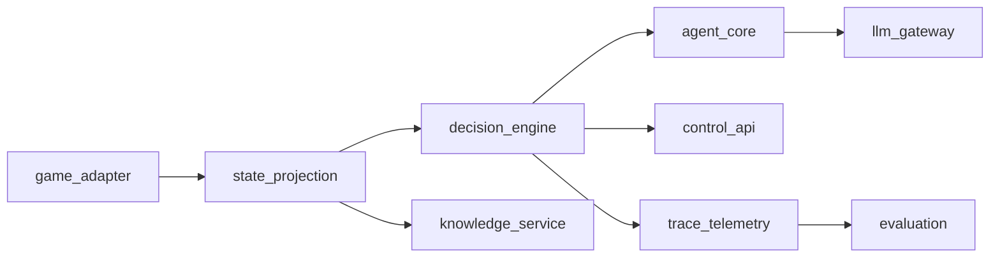

# Restart Architecture

## Purpose
This document defines the target architecture for the clean restart and acts as the implementation reference for the `docs/restart` plan set.

## Goals
- Preserve all current functionality with explicit contracts.
- Remove cross-layer coupling and stringly-typed behavior.
- Keep side effects isolated at system boundaries.
- Enforce quality gates from the first rewrite slice.

## Architectural Principles
- Domain-first design: business logic is independent of frameworks and providers.
- Typed boundaries: all cross-module interfaces use explicit schemas.
- Deterministic core: projection, resolution, and validation are pure where possible.
- Observable runtime: structured telemetry with trace correlation.
- Incremental migration: ship vertical slices with parity checks.

## LangChain and LangGraph Decisions
- Orchestration runtime: LangGraph (`StateGraph`) for durable, stateful execution.
- Agent construction: LangChain v1 patterns with explicit structured output.
- Human-in-the-loop: LangGraph interrupts + resume commands as the approval primitive.
- Memory model:
  - short-term conversational state in graph state/checkpoint,
  - long-term memory through store-backed runtime tools.
- Debug and recovery: use checkpoint history for replay/time-travel style debugging.

## Logical Modules

### `game_adapter`
- Owns CommunicationMod protocol ingestion/emission.
- Converts external payloads to typed ingress DTOs.
- Is the only layer that writes commands back to the game.

### `state_projection`
- Transforms ingress state into typed read models:
  - decision-facing model
  - UI-facing view model
- Computes legal actions deterministically.
- Performs no network, storage, or provider calls.

### `decision_engine`
- Orchestrates runtime mode (`manual`, `propose`, `auto`).
- Manages proposal lifecycle: in-flight, stale, timeout, recovered.
- Owns queued command sequence state and execution policy.
- Compiles and runs the LangGraph with checkpointing enabled.

### `agent_core`
- Builds decision context.
- Parses model output to typed decision schema.
- Resolves decisions to legal commands with explainable fallback order.
- Enforces structured output schema at agent boundary.

### `llm_gateway`
- Encapsulates all model provider interactions.
- Handles retries, timeouts, model routing, and usage metadata.
- Returns provider-agnostic typed response objects.
- Selects between LangChain `ProviderStrategy` and `ToolStrategy` based on model/provider capability.

### `knowledge_service`
- Provides indexed lookups for cards/relics/monsters/events/powers/potions.
- Exposes stable typed lookup APIs with explicit miss behavior.

### `control_api`
- Exposes operator and UI endpoints (state, trace, approve/reject, mode changes).
- Publishes websocket events for live updates.
- Uses versioned DTOs for all request/response payloads.
- Translates approval/reject/edit requests into graph resume commands.

### `trace_telemetry`
- Emits runtime events, statuses, and diagnostics.
- Persists structured sidecar records for replay analysis.
- Maintains schema version compatibility guarantees.

### `evaluation`
- Runs offline replay and parity analytics.
- Produces run-level metrics and regression reports.

## Dependency Direction
Inner domain modules must not import outer adapters/frameworks.

### Import Direction vs Runtime Flow
The diagram below describes runtime call/data flow, not Python import direction.

Import direction requirements are strict:
- `domain/*` imports only `domain/*` and `domain/contracts/*`.
- `interfaces/*` (for example `control_api`) may import domain application services/ports, but domain must never import interface/framework modules.
- `adapters/*` implement domain-defined ports and may import provider/framework SDKs.
- Framework objects (FastAPI request/response, websocket/session types, provider SDK classes) must not cross into domain contracts.



## Runtime Flows

### 1) State and Decision Flow
1. `game_adapter` receives raw game payload.
2. `state_projection` builds typed decision/UI models.
3. `decision_engine` determines mode behavior.
4. In AI modes, `agent_core` requests model work via `llm_gateway`.
5. `agent_core` validates/resolves command against legal actions.
6. `decision_engine` authorizes execution or waits for approval.
7. `game_adapter` emits final command to the game.

### 2) Human-in-the-Loop Flow
1. Approval node/tool issues LangGraph `interrupt(...)` with a typed review payload.
2. `control_api` renders the interrupt evidence pack and accepted decision types.
3. Operator action is sent back as `Command(resume=...)` on the same `thread_id`.
4. Graph routes explicitly (`proceed`/`cancel`/`revise`) and updates state.
5. Resulting decision status is emitted through `trace_telemetry`.
6. Approved command executes through `game_adapter`.

### 3) Replay and Analytics Flow
1. `trace_telemetry` persists state and decision sidecars.
2. `evaluation` consumes immutable logs.
3. Metrics are compared against baseline thresholds for parity.

## Core Contracts
- `IngressState` (adapter input)
- `ProjectedState` (decision + UI projections)
- `LegalAction` (typed command candidates)
- `DecisionProposal` (model output contract)
- `ExecutionDecision` (authorized command and reason)
- `TraceEvent` (versioned telemetry records)

All contracts are versioned and tested with contract fixtures.

## Canonical Graph State (LangGraph)
The runtime must use one canonical `AgentRuntimeState` schema across all nodes.

- `game`: `state_id`, `turn_key`, ingress payload reference, projection reference.
- `mode`: current mode and policy flags.
- `proposal`: proposal id, status, candidate commands, validation details.
- `approval`: interrupt id, allowed actions, operator response payload.
- `execution`: chosen command, source, execution outcome, failure metadata.
- `telemetry`: trace ids, checkpoint ids, latency/token usage summaries.

Node rule: each node returns only partial updates for its owned fields; no node should rebuild or replace the entire state object.

## Node Ownership Model
- `ingest_node` writes: `game`
- `project_node` writes: `game` projection refs
- `propose_node` writes: `proposal`
- `validate_node` writes: `proposal`
- `approval_node` writes: `approval`
- `execute_node` writes: `execution`
- `telemetry_node` writes: `telemetry`

Cross-node mutation of unrelated state sections is disallowed.

## State Machines

### Proposal Lifecycle
- `idle -> building_prompt -> running -> awaiting_approval -> executed`
- Error transitions:
  - `running -> error`
  - `awaiting_approval -> stale`
  - `running -> timed_out`
  - `awaiting_approval -> resumed` (after operator action)

### Approval Lifecycle
- `pending -> approved|edited|rejected|stale`

## Reliability and Safety
- Timeout and retry policy is centralized in `decision_engine` and `llm_gateway`.
- Stale-state protection uses deterministic `state_id` and proposal correlation ids.
- Current runtime note: `state_id` is content-derived (hash of normalized ingress payload), not a monotonic counter.
- No command executes without legal-action verification at execution time.
- Failure streak thresholds can degrade runtime to safe manual mode.
- Every operator gate must be replayable from checkpoint history.

### Checkpoint and Telemetry Consistency Contract
- Runtime uses checkpoints as the source of recovery truth and canonical logs as the source of analytics/audit truth.
- On each critical transition, write ordering is:
  1. transition/domain decision computed,
  2. checkpoint write attempted,
  3. canonical event append attempted with idempotency key (`thread_id`, `checkpoint_id`, `event_type`),
  4. optional external trace export.
- If event append fails after checkpoint success, emit a local recovery marker and enqueue re-append via outbox/reconciler.
- Replay tooling must tolerate at-least-once event delivery using event idempotency keys.

## Security Baseline
- Mutating endpoints are local-only by default.
- Non-local deployments require authentication and authorization middleware.
- Secrets are loaded via validated config and never logged.

### Control Plane Security Profile
Minimum requirements by deployment profile:
- `local`: bind localhost only, no external ingress, explicit operator warning in UI.
- `remote-dev`: authenticated HTTP and websocket channels, CSRF/CORS policy, request rate limits on mutating endpoints.
- `prod`: role-based authorization (`viewer`/`operator`/`admin`), audit logs for all mutating actions, replay/update-state permissions gated to privileged roles.

## Quality Gate Integration
Implementation is blocked unless:
- compile/import smoke checks pass,
- replay regression checks pass for migrated slices,
- graph runtime compiles with checkpointer-enabled smoke path.

## Suggested Package Layout
```text
src/
  domain/
    state_projection/
    decision_engine/
    agent_core/
    contracts/
  adapters/
    game_adapter/
    llm_gateway/
    knowledge_service/
    trace_telemetry/
  interfaces/
    control_api/
  evaluation/
```

## Migration Note
This architecture is implemented incrementally following `docs/restart/08-migration-plan.md` to maintain behavior parity and avoid a risky big-bang cutover.

## Related Design Specs
- `docs/restart/09-observability-and-debugger-design.md` defines canonical event schema, dashboard UX, and logging/tracing sink strategy.
- `docs/restart/10-langgraph-persistence-and-hitl-ops.md` defines thread/checkpoint operations, replay/update-state governance, and HITL runtime rules.
- `docs/restart/11-memory-strategy.md` defines short-term vs long-term memory design, retention controls, and store policy.

## Context7 Feature Notes
- The planning assumptions in this document are aligned with recent LangChain/LangGraph docs surfaced through Context7, especially:
  - LangChain v1 structured output strategies,
  - LangGraph checkpointers for durable execution,
  - interrupt/resume workflows for human approval,
  - typed state schemas and subgraph-oriented composition.
