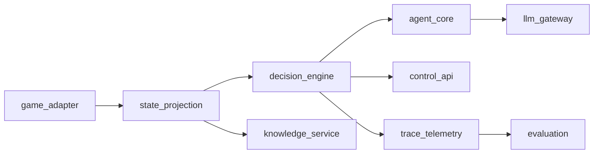

# Target Architecture

## Architecture Summary
The restart uses a domain-first architecture with strict boundary control:
- domain logic is pure and typed,
- side effects live in adapters/interfaces,
- orchestration is LangGraph-based and durable,
- telemetry is structured and replayable.

This is a **greenfield implementation**: module names and the package tree below are the **default proposal**. Rename or split packages when it improves clarity; keep dependency rules and contract stability as the hard constraints.

## Module Topology
- `game_adapter`: protocol boundary with game process.
- `state_projection`: deterministic projection to decision/UI models.
- `decision_engine`: mode orchestration, lifecycle, queue policy, retries.
- `agent_core`: model-agnostic decision parsing/validation/resolution.
- `llm_gateway`: provider API abstraction and model routing.
- `knowledge_service`: read-only game knowledge lookups.
- `control_api`: REST/WS operator and debugger API.
- `trace_telemetry`: canonical events + stream event persistence.
- `evaluation`: replay analytics and parity checks.



## Dependency Rules
1. Domain modules never import interface/framework/provider modules.
2. `llm_gateway` is the only provider-SDK boundary.
3. `state_projection` is side-effect free.
4. UI/control layer cannot mutate decision state directly.
5. Graph nodes return partial state updates only.

## Canonical Runtime State
Use one `AgentRuntimeState` across all nodes:
- `game`: `state_id`, `turn_key`, projection references.
- `mode`: runtime mode and policy flags.
- `proposal`: proposal identity/status/candidates/validation.
- `approval`: interrupt identity/allowed actions/operator response.
- `execution`: selected command/source/outcome.
- `telemetry`: trace/checkpoint ids and usage summaries.
- `strategic_plan`: active plan identity/trigger/horizon/alignment status.

## Runtime Flows
- **State/Decision Flow**: ingest -> project -> plan(optional) -> propose -> validate -> approve/auto -> execute.
- **HITL Flow**: interrupt -> review -> resume -> route.
- **Replay/Analytics Flow**: canonical event persistence -> replay reconstruction -> parity metrics.

## Technical Stack (Target)
- Python runtime with typed contracts.
- LangGraph `StateGraph` for orchestration and checkpointed execution.
- LangChain v1 structured output (`ProviderStrategy` + `ToolStrategy` fallback).
- SQLite canonical telemetry for local/dev.
- Postgres checkpointer/store and telemetry for production profile.

## Package Layout (Target)
Illustrative layout only—the team may use a different top-level package name, nest modules differently, or split/merge boundaries as long as **dependency rules** hold.

```text
src/
  domain/
    state_projection/
    decision_engine/
    agent_core/
    contracts/
  adapters/
    game_adapter/
    llm_gateway/
    knowledge_service/
    trace_telemetry/
  interfaces/
    control_api/
  evaluation/
```
